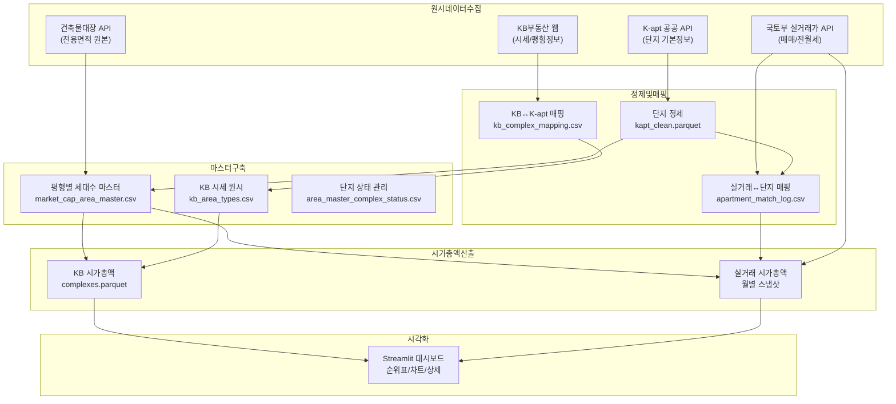
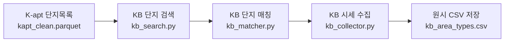
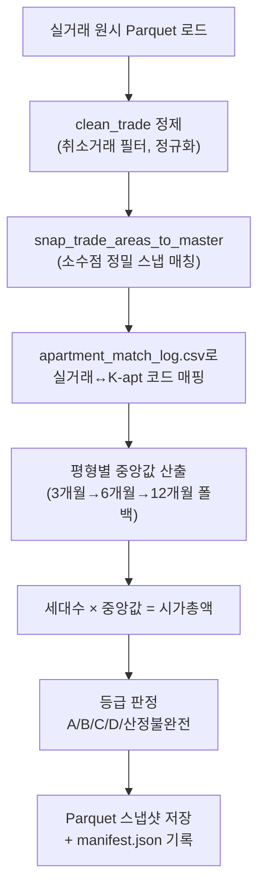
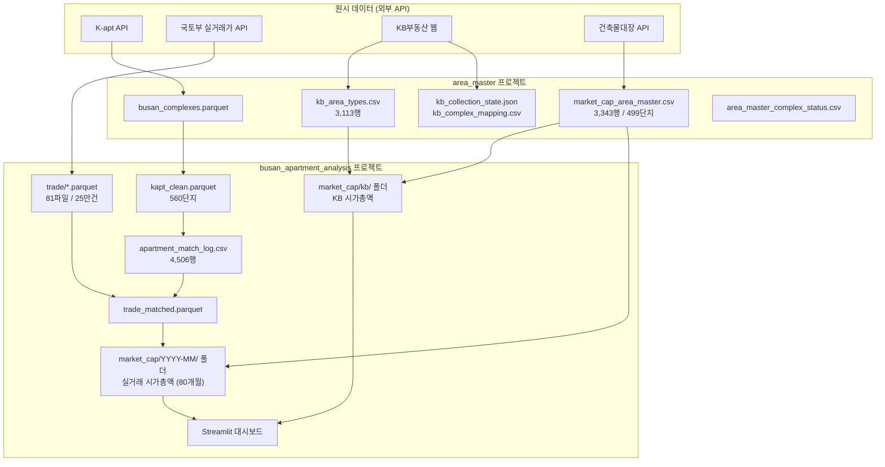

# 부산 아파트 시가총액 데이터 수집·처리 파이프라인 운영 보고서

> **최종 갱신일**: 2026-09-21  
> **갱신 주기**: 월 1회  
> **대상 지역**: 부산광역시 전역 (16개 자치구)  
> **산출 대상**: 500세대 이상 아파트·주상복합 560개 단지, 총 592,879세대

---

## 목차

1. [전체 아키텍처 개요](#1-전체-아키텍처-개요)
2. [STEP 1: 원시 데이터 수집](#2-step-1-원시-데이터-수집)
3. [STEP 2: 단지 정보 정제 및 매핑](#3-step-2-단지-정보-정제-및-매핑)
4. [STEP 3: 평형별 세대수 마스터 구축](#4-step-3-평형별-세대수-마스터-구축)
5. [STEP 4: KB 시세 수집 및 매핑](#5-step-4-kb-시세-수집-및-매핑)
6. [STEP 5: 시가총액 산출 (KB 시세 기준)](#6-step-5-시가총액-산출-kb-시세-기준)
7. [STEP 6: 시가총액 산출 (실거래가 기준)](#7-step-6-시가총액-산출-실거래가-기준)
8. [STEP 7: 대시보드 시각화](#8-step-7-대시보드-시각화)
9. [데이터 흐름도](#9-데이터-흐름도)
10. [현재 산출 현황 요약](#10-현재-산출-현황-요약)
11. [월별 갱신 작업 가이드](#11-월별-갱신-작업-가이드)

---

## 1. 전체 아키텍처 개요



### 프로젝트 디렉토리 구조

| 프로젝트 | 경로 | 역할 |
|:---|:---|:---|
| **area_master** | `kapt/area_master/` | 평형별 세대수 마스터 구축 + KB 시세 수집 |
| **busan_apartment_analysis** | `kapt/busan_apartment_analysis/` | 실거래가 수집·정제·시가총액 산출·대시보드 |

---

## 2. STEP 1: 원시 데이터 수집

### 2-1. K-apt 단지 기본정보

| 항목 | 내용 |
|:---|:---|
| **데이터 소스** | K-apt(공동주택관리정보시스템) Open API |
| **수집 스크립트** | [collect_kapt.py](file:///d:/90.invest/80.데이터수집/아파트정보수집/kapt/busan_apartment_analysis/src/collect_kapt.py) |
| **저장 위치** | `busan_apartment_analysis/data/raw/kapt/busan_complexes.parquet` |
| **수집 항목** | 단지코드, 단지명, 주소, 세대수, 사용승인일, 분양/임대 구분, 건물유형 등 |
| **현재 현황** | 부산시 전체 **560개 단지** (500세대 이상 기준) |

### 2-2. 국토부 실거래가

| 항목 | 내용 |
|:---|:---|
| **데이터 소스** | 국토교통부 실거래가 공개시스템 API |
| **수집 스크립트** | [collect_trade.py](file:///d:/90.invest/80.데이터수집/아파트정보수집/kapt/busan_apartment_analysis/src/collect_trade.py) |
| **저장 위치** | `busan_apartment_analysis/data/raw/trade/` (구별 Parquet, 81개 파일) |
| **수집 항목** | 법정동코드, 단지명, 전용면적, 거래금액, 층수, 계약일 등 |
| **수집 기간** | 2020-01 ~ 현재 (약 25만 건) |

### 2-3. 국토부 전월세

| 항목 | 내용 |
|:---|:---|
| **수집 스크립트** | [collect_rent.py](file:///d:/90.invest/80.데이터수집/아파트정보수집/kapt/busan_apartment_analysis/src/collect_rent.py) |
| **저장 위치** | `busan_apartment_analysis/data/raw/rent/` (구별 Parquet, 81개 파일) |

### 2-4. KB부동산 시세 및 평형정보

| 항목 | 내용 |
|:---|:---|
| **데이터 소스** | KB부동산 웹사이트 (kbland.kr) |
| **수집 스크립트** | [build_kb_area_master.py](file:///d:/90.invest/80.데이터수집/아파트정보수집/kapt/area_master/scripts/build_kb_area_master.py) |
| **핵심 모듈** | [kb_collector.py](file:///d:/90.invest/80.데이터수집/아파트정보수집/kapt/area_master/src/kb_area_master/kb_collector.py), [kb_browser.py](file:///d:/90.invest/80.데이터수집/아파트정보수집/kapt/area_master/src/kb_area_master/kb_browser.py) |
| **저장 위치** | `area_master/data/raw/kb/kb_area_types.csv` |
| **수집 항목** | KB단지ID, 평형명, 전용면적, 공급면적, 세대수, 매매 일반/상한/하한가 등 |
| **현재 현황** | **3,113행** (465개 단지) |

### 2-5. 건축물대장

| 항목 | 내용 |
|:---|:---|
| **데이터 소스** | 국토교통부 건축물대장 공공 API |
| **수집 스크립트** | [build_area_master.py](file:///d:/90.invest/80.데이터수집/아파트정보수집/kapt/area_master/scripts/build_area_master.py) |
| **핵심 모듈** | [bldrgst_client.py](file:///d:/90.invest/80.데이터수집/아파트정보수집/kapt/area_master/src/area_master/bldrgst_client.py) |
| **역할** | K-apt 세대수와 전용면적 소수점 2자리 기준을 건축물대장 원본에서 교차검증 |

---

## 3. STEP 2: 단지 정보 정제 및 매핑

### 3-1. K-apt 단지 정제

| 항목 | 내용 |
|:---|:---|
| **스크립트** | [clean_kapt.py](file:///d:/90.invest/80.데이터수집/아파트정보수집/kapt/busan_apartment_analysis/src/clean_kapt.py) |
| **입력** | `busan_complexes.parquet` (원시) |
| **출력** | `kapt_clean.parquet` (정제) |
| **처리 내용** | 단지명 정규화, 주소 파싱, 좌표 보정, 중복 제거 |

### 3-2. 실거래가 ↔ K-apt 단지 매핑

| 항목 | 내용 |
|:---|:---|
| **스크립트** | [match_complex.py](file:///d:/90.invest/80.데이터수집/아파트정보수집/kapt/busan_apartment_analysis/src/match_complex.py) |
| **출력** | [apartment_match_log.csv](file:///d:/90.invest/80.데이터수집/아파트정보수집/kapt/busan_apartment_analysis/data/processed/apartment_match_log.csv) |
| **현재 현황** | 전체 4,506개 고유 (동·지번·단지명) 조합 중 **1,455건 매칭** (1,359개 단지) |

> [!IMPORTANT]
> **복합단지 통합 매핑**: 동래래미안아이파크(1~4단지), LG메트로시티(1~5차), 레이카운티(1~5단지), e편한세상오션테라스(1~4단지) 등 **분할 신고되는 복합단지는 대표 K-apt 코드 1개로 통합 매핑**되어 있습니다. 새로운 복합단지 추가 시 이 로그에 수동 추가가 필요합니다.

### 3-3. KB부동산 ↔ K-apt 단지 매핑

| 항목 | 내용 |
|:---|:---|
| **매핑 모듈** | [kb_matcher.py](file:///d:/90.invest/80.데이터수집/아파트정보수집/kapt/area_master/src/kb_area_master/kb_matcher.py) |
| **저장 위치** | [kb_complex_mapping.csv](file:///d:/90.invest/80.데이터수집/아파트정보수집/kapt/area_master/data/mapping/kb_complex_mapping.csv) |
| **수집 상태** | [kb_collection_state.json](file:///d:/90.invest/80.데이터수집/아파트정보수집/kapt/area_master/data/state/kb_collection_state.json) |
| **현재 현황** | VERIFIED: 365, PENDING: 194, FAILED: 1 |

---

## 4. STEP 3: 평형별 세대수 마스터 구축

### 구축 절차 (4단계 파이프라인)


| 단계 | 스크립트 | 역할 |
|:---|:---|:---|
| **1단계** | [build_area_master.py](file:///d:/90.invest/80.데이터수집/아파트정보수집/kapt/area_master/scripts/build_area_master.py) | 건축물대장 API → 전용면적별 세대수 자동 추출 |
| **2단계** | [process_area_master_exceptions.py](file:///d:/90.invest/80.데이터수집/아파트정보수집/kapt/area_master/scripts/process_area_master_exceptions.py) | 건축물대장에서 불일치한 단지를 KB 데이터로 보정 |
| **3단계** | [process_area_master_phase3.py](file:///d:/90.invest/80.데이터수집/아파트정보수집/kapt/area_master/scripts/process_area_master_phase3.py) | 잔여 Pending 단지 사용자 검토 및 수동 보정 |
| **4단계** | [validate_area_master_phase4.py](file:///d:/90.invest/80.데이터수집/아파트정보수집/kapt/area_master/scripts/validate_area_master_phase4.py) | 무결성 검증, 혼합단지 감사, 릴리스 확정 |

### 최종 산출물

| 파일 | 행수 | 설명 |
|:---|:---:|:---|
| [market_cap_area_master.csv](file:///d:/90.invest/80.데이터수집/아파트정보수집/kapt/area_master/data/releases/area_master_20260918/market_cap_area_master.csv) | **3,343** | 499개 단지 × 평형별 세대수 (핵심 마스터) |
| [area_master_complex_status.csv](file:///d:/90.invest/80.데이터수집/아파트정보수집/kapt/area_master/data/releases/area_master_20260918/area_master_complex_status.csv) | 560 | 전 단지 상태 (VERIFIED: 499, EXCLUDED: 49, PENDING: 12) |
| [phase4_mixed_complex_audit.csv](file:///d:/90.invest/80.데이터수집/아파트정보수집/kapt/area_master/data/qa/phase4_mixed_complex_audit.csv) | - | 혼합(분양+임대) 단지 감사 기록 |

### 마스터 컬럼 구조

```
kapt_code, area_group_id, exclusive_area_sqm, supply_area_sqm,
type_name, households, source, verified_at, valid_from, valid_to,
verification_status, scope, notes
```

> [!TIP]
> **복합단지 통합**: 레이카운티(13평형, 4,470세대), LG메트로시티(25평형, 7,374세대), e편한세상오션테라스(10평형, 1,038세대), 동래래미안아이파크(17평형, 3,853세대)는 각각 **KB 여러 단지의 세대수·시세를 가중평균 통합**하여 1개 K-apt 코드의 마스터 행으로 등록되어 있습니다.

---

## 5. STEP 4: KB 시세 수집 및 매핑

### 수집 절차



| 항목 | 내용 |
|:---|:---|
| **스크립트** | [build_kb_area_master.py](file:///d:/90.invest/80.데이터수집/아파트정보수집/kapt/area_master/scripts/build_kb_area_master.py) |
| **출력 파일** | [kb_area_types.csv](file:///d:/90.invest/80.데이터수집/아파트정보수집/kapt/area_master/data/raw/kb/kb_area_types.csv) (3,113행) |
| **수집 항목** | 평형별 일반매매가, 상한가, 하한가, 전세가, 월세보증금/임대료, 수집일시 |

### KB 외삽 보정 정책

- 파일: [market_cap_kb_adjustments.json](file:///d:/90.invest/80.데이터수집/아파트정보수집/kapt/area_master/config/market_cap_kb_adjustments.json)
- KB 시세가 없는 소수 평형(펜트하우스 등)에 대해 **가장 가까운 전용면적의 ㎡당 단가**를 적용하여 전 세대 시가총액을 빈틈없이 산출

---

## 6. STEP 5: 시가총액 산출 (KB 시세 기준)

| 항목 | 내용 |
|:---|:---|
| **핵심 모듈** | [market_cap_kb.py](file:///d:/90.invest/80.데이터수집/아파트정보수집/kapt/busan_apartment_analysis/src/market_cap_kb.py) |
| **실행 스크립트** | [run_market_cap_kb_batch.py](file:///d:/90.invest/80.데이터수집/아파트정보수집/kapt/area_master/scripts/run_market_cap_kb_batch.py) |
| **출력 위치** | `area_master/data/processed/market_cap/kb/{run_id}/` |

### 산출 로직
1. 마스터(`market_cap_area_master.csv`)에서 `scope=sale_apartment`, `verification_status=verified` 행만 사용
2. KB 원시 시세(`kb_area_types.csv`)를 마스터 평형에 매칭하여 **세대수 × KB 일반매매가** 합산
3. 누락 평형은 외삽 보정 정책(`market_cap_kb_adjustments.json`)으로 인접 단가 적용
4. 산출물별 콘텐츠 SHA-256을 메타데이터에 기록하고 불변 snapshot으로 저장
5. 웹서비스는 `src.sync_area_master_market_cap`으로 검증된 snapshot만 동기화

---

## 7. STEP 6: 시가총액 산출 (실거래가 기준)

| 항목 | 내용 |
|:---|:---|
| **핵심 모듈** | [market_cap.py](file:///d:/90.invest/80.데이터수집/아파트정보수집/kapt/busan_apartment_analysis/src/market_cap.py) |
| **배치 스크립트** | [market_cap_batch.py](file:///d:/90.invest/80.데이터수집/아파트정보수집/kapt/busan_apartment_analysis/src/market_cap_batch.py) |
| **규칙 파일** | [market_cap.json](file:///d:/90.invest/80.데이터수집/아파트정보수집/kapt/busan_apartment_analysis/config/market_cap.json) |
| **출력 위치** | `busan_apartment_analysis/data/processed/market_cap/{월}/{run_id}/` |

### 산출 규칙 (`market_cap.json`)

```json
{
  "version": "trade-median-v1",
  "minimum_households": 500,
  "minimum_transactions": 3,
  "windows": [3, 6, 12],
  "area_tolerance_sqm": 0.0,
  "default_grades": ["A", "B"],
  "price_source": "transaction_median"
}
```

### 산출 절차 (매월)



### 소수점 정밀 스냅 매칭

> [!WARNING]
> 국토부 실거래가의 전용면적은 4자리 소수점(예: `84.9856㎡`)으로 표기되지만, 마스터는 2자리(예: `84.98㎡`)입니다. 단순 `round(area, 2)` 시 사사오입으로 `84.99㎡`(다른 평형)로 오매칭되므로, 반드시 **단지별 마스터 면적과 0.01㎡ 이내 스냅 매칭**을 적용해야 합니다.

### 등급 체계

| 등급 | 기준 | 의미 |
|:---:|:---|:---|
| **A** | 3개월 이내 거래 데이터만으로 전 평형 산출 | 최고 품질 |
| **B** | 6개월 이내 데이터 포함 | 양호 |
| **C** | 12개월 이내 데이터 포함 | 참고용 |
| **D** | small sample (최소 거래 미달) 평형 포함 | 추정 포함 |
| **산정 불완전** | 일부 평형 시세 미확보 또는 매핑 미완료 | 순위표 제외 |

### 현재 산출 현황 (2026-08 기준)

| 등급 | 단지 수 | 비고 |
|:---:|:---:|:---|
| A | 29 | 3개월 전수 데이터 충분 |
| B | 35 | 6개월까지 확대 필요 |
| C | 83 | 12개월까지 확대 필요 |
| D | 135 | 소수 평형 추정 포함 |
| 산정 불완전 | 278 | 매핑/시세 추가 보완 필요 |

---

## 8. STEP 7: 대시보드 시각화

| 항목 | 내용 |
|:---|:---|
| **프레임워크** | Streamlit |
| **메인 화면** | [market_cap_display.py](file:///d:/90.invest/80.데이터수집/아파트정보수집/kapt/busan_apartment_analysis/src/market_cap_display.py) |
| **기능** | 순위표, 구별 필터, 검색, 단지 상세(평형별 기여도), 월별 추이, 단지 간 비교, CSV 다운로드 |

---

## 9. 데이터 흐름도



---

## 10. 현재 산출 현황 요약

### 핵심 파일 일람

| 파일 | 경로 | 행수/규모 | 갱신주기 |
|:---|:---|:---:|:---:|
| **평형별 세대수 마스터** | `area_master/data/releases/.../market_cap_area_master.csv` | 3,343행 | 필요시 |
| **KB 시세 원시** | `area_master/data/raw/kb/kb_area_types.csv` | 3,113행 | 월 1회 |
| **실거래 매핑 로그** | `busan_apartment_analysis/data/processed/apartment_match_log.csv` | 4,506행 | 신규 단지 시 |
| **KB 시가총액** | `busan_apartment_analysis/data/processed/market_cap/kb/` | 560단지 | 월 1회 |
| **실거래 시가총액** | `busan_apartment_analysis/data/processed/market_cap/{월}/` | 80개월 | 월 1회 |
| **매니페스트** | `busan_apartment_analysis/data/processed/market_cap/manifest.json` | - | 자동 |

### 4대 복합단지 통합 산출 현황

| 단지명 | K-apt 코드 | 구성 | 총세대수 | KB 시가총액 | 실거래 시가총액 |
|:---|:---:|:---|:---:|:---:|:---:|
| **LG메트로시티** | `A60809004` | 1~5차 (KB 6개) | 7,374 | 4조 5,131억 | 4조 3,570억 |
| **레이카운티** | `A10022890` | 1~5단지 (KB 5개) | 4,470 | 4조 4,448억 | 4조 4,528억 |
| **동래래미안아이파크** | `A10023975` | 1~4단지 (KB 3개) | 3,853 | 3조 7,566억 | 3조 5,150억 |
| **e편한세상오션테라스** | `A10025075` | 1~4단지 (KB 4개) | 1,038 | 9,350억 | 8,903억 |

---

## 11. 월별 갱신 작업 가이드

> [!IMPORTANT]
> 아래 작업을 매월 1회 순서대로 수행하면 최신 시가총액 데이터가 갱신됩니다.

### 갱신 작업 체크리스트

```
□ STEP A: 실거래가 수집 (필수, 매월)
□ STEP B: KB 시세 갱신 (필수, 매월)
□ STEP C: 실거래 시가총액 배치 (필수, 매월)
□ STEP D: KB 시가총액 배치 (필수, 매월)
□ STEP E: 마스터 보정 (선택, 필요시만)
```

---

### STEP A: 실거래가 수집 (매월 필수)

**목적**: 최신 월의 실거래 데이터를 수집하여 파이프라인에 반영

```bash
# busan_apartment_analysis 프로젝트에서 실행
cd d:\90.invest\80.데이터수집\아파트정보수집\kapt\busan_apartment_analysis

# 1. 실거래가 수집 (자동으로 부산 전 구 수집)
python -m src.collect_trade

# 2. 전월세 수집
python -m src.collect_rent
```

> [!NOTE]
> `collect_trade.py`는 국토부 API를 호출하여 부산 16개 자치구별 최신 실거래가를 수집합니다. API 일일 트래픽 제한이 있으므로 오전 시간대 실행을 권장합니다.

---

### STEP B: KB 시세 갱신 (매월 필수)

**목적**: KB부동산 최신 시세를 수집하여 `kb_area_types.csv` 갱신

```bash
# area_master 프로젝트에서 실행
cd d:\90.invest\80.데이터수집\아파트정보수집\kapt\area_master

# KB 시세 수집 (VERIFIED 상태 단지만 갱신)
python scripts/build_kb_area_master.py
```

**관련 파일**:
- 입력: `data/state/kb_collection_state.json` (수집 상태)
- 출력: `data/raw/kb/kb_area_types.csv` (갱신된 시세)

> [!TIP]
> KB 시세 수집은 브라우저 자동화(Selenium/Playwright)를 사용합니다. 수집 중 `QuotaExceededError`가 발생하면 잠시 대기 후 재실행하세요.

---

### STEP C: 실거래 시가총액 배치 (매월 필수)

**목적**: 최신 실거래 데이터로 시가총액 산출

```bash
# busan_apartment_analysis 프로젝트에서 실행
cd d:\90.invest\80.데이터수집\아파트정보수집\kapt\busan_apartment_analysis

# 최신월 시가총액 산출
python -m src.market_cap_batch --month YYYY-MM --reason "YYYY년 MM월 정기 갱신"

# 예시: 2026년 9월 데이터
python -m src.market_cap_batch --month 2026-09 --reason "2026년 9월 정기 갱신"
```

**산출물**: `data/processed/market_cap/YYYY-MM/{run_id}/`
- `complexes.parquet` — 단지별 시가총액, 등급, 순위
- `areas.parquet` — 평형별 거래 중앙값, 기여도
- `trades.parquet` — 사용된 개별 거래 내역
- `metadata.json` — 실행 조건 및 감사 정보

> [!WARNING]
> **`--reason` 플래그는 필수입니다.** 이미 산출된 월을 재실행할 때 개정 사유를 기록합니다. 신규 월은 자동으로 생성됩니다.

---

### STEP D: KB 시가총액 배치 (매월 필수)

**목적**: 최신 KB 시세로 KB 기준 시가총액 산출

```bash
# area_master 프로젝트에서 실행
cd d:\90.invest\80.데이터수집\아파트정보수집\kapt\area_master

# KB 시가총액 산출
python scripts/run_market_cap_kb_batch.py
```

**산출물**: `area_master/data/processed/market_cap/kb/{run_id}/`
- `complexes.parquet` — 단지별 KB 시가총액 및 조정 시가총액
- `areas.parquet` — 평형별 원가격·보정가격·출처·기여액
- `metadata.json` — 입력·규칙·산출물 해시와 보정 정책
- `summary.csv` — 단지별 검수용 CSV

웹서비스 반영:

```bash
cd ..\busan_apartment_analysis
.venv\Scripts\python.exe -m src.sync_area_master_market_cap
```

---

### STEP E: 마스터 보정 (선택, 필요시만)

아래 상황에서만 추가 작업이 필요합니다:

#### E-1. 신규 단지 등장 시

K-apt에 새로 등록된 단지가 있으면:
1. `collect_kapt.py` 재실행 → `busan_complexes.parquet` 갱신
2. `clean_kapt.py` 재실행 → `kapt_clean.parquet` 갱신
3. `build_area_master.py --kapt-code AXXXXXXXX` → 해당 단지 마스터 추가
4. `build_kb_area_master.py` → KB 매핑 및 시세 수집

#### E-2. 신규 복합단지 통합 필요 시

새로운 복합단지(여러 단지/차수가 1개의 K-apt 코드에 해당)를 추가하려면:
1. `integrate_multi_complexes.py`에 `COMPLEX_CONFIGS` 딕셔너리에 신규 단지 추가
2. `apartment_match_log.csv`에 각 차수/단지명 → 대표 K-apt 코드 매핑 행 추가
3. `market_cap_kb_adjustments.json`에 해당 단지 등록
4. 스크립트 실행 → KB 배치 → 실거래 배치 순서로 갱신

#### E-3. 마스터 세대수 오류 발견 시

1. `market_cap_area_master.csv` 직접 수정 또는 해당 단계 스크립트 재실행
2. `area_master_complex_status.csv` 상태 갱신
3. KB 배치 + 실거래 배치 재실행

---

### 월별 갱신 요약 타임라인

```mermaid
gantt
    title 월별 데이터 갱신 작업 타임라인
    dateFormat HH:mm
    axisFormat %H:%M

    section STEP A
    실거래가 수집 (API 호출)        :a1, 09:00, 30min
    전월세 수집                      :a2, after a1, 30min

    section STEP B
    KB 시세 갱신 (브라우저 자동화)   :b1, after a2, 60min

    section STEP C
    실거래 시가총액 배치             :c1, after b1, 5min

    section STEP D
    KB 시가총액 배치                 :d1, after c1, 2min

    section 검증
    대시보드 확인                    :e1, after d1, 10min
```



**총 소요 시간**: 약 2~3시간 (API 호출 + 브라우저 자동화 포함)

---

### 갱신 시 주의사항

> [!CAUTION]
> 1. **실거래 수집 → KB 수집 → 실거래 배치 → KB 배치** 순서를 지켜주세요. 마스터 파일이 양쪽 배치의 공통 입력이므로 마스터 변경 후에는 양쪽 모두 재실행해야 합니다.
> 2. **`.batch.lock` 파일**: 배치 실행 중 비정상 종료 시 `data/processed/market_cap/.batch.lock` 파일이 남을 수 있습니다. 수동 삭제 후 재실행하세요.
> 3. **마스터 변경 시**: `area_master` 릴리스와 보정 정책을 수정한 뒤 KB 배치를 실행하고 `src.sync_area_master_market_cap`으로 웹서비스 사본을 갱신합니다. 웹서비스의 사본을 직접 수정하지 않습니다.
> 4. **area_tolerance_sqm = 0** 규칙은 절대 변경하지 마세요. 정밀 매칭은 `snap_trade_areas_to_master` 함수가 데이터 레이어에서 처리합니다.

---

### 재작업이 필요한 경우별 가이드

| 상황 | 재작업 범위 | 비고 |
|:---|:---|:---|
| 실거래 데이터만 갱신 | STEP A → C | 가장 일반적인 경우 |
| KB 시세만 갱신 | STEP B → D | KB 시세 갱신 시 |
| 마스터(세대수) 변경 | STEP C + D 모두 재실행 | 양쪽 배치 영향 |
| 신규 단지 추가 | STEP E-1 → B → C → D | 전체 플로우 |
| 복합단지 통합 추가 | STEP E-2 → B → C → D | 매핑 + 전체 배치 |
| 매핑 로그 수정 | STEP C 재실행 | 실거래 배치만 |
| 대시보드 UI만 변경 | 없음 | Streamlit 재시작만 |
