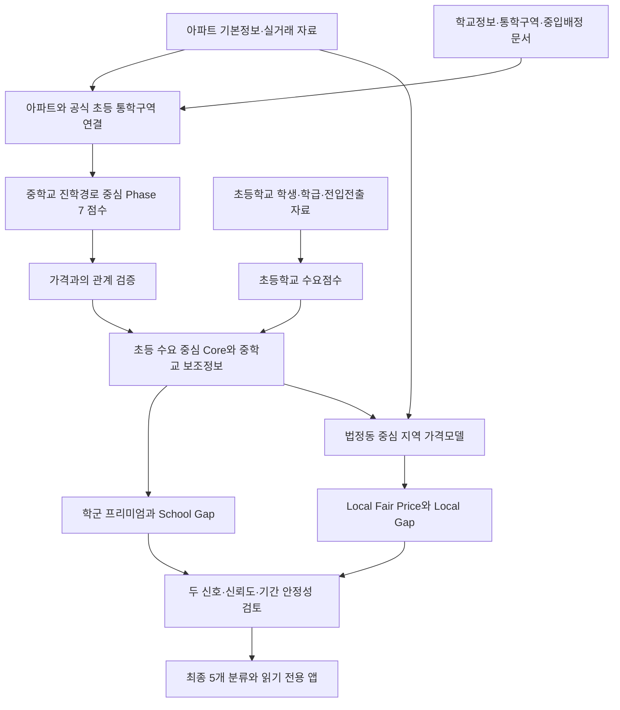

# 부산 아파트 학군·상대가치 분석 종합 결과보고서

> 처음 사용하는 사람을 위한 데이터, 분석 절차, 결과 및 화면 해석 안내
>
> 작성일: 2026-09-12  
> 대상: Phase 1~15.4의 저장된 분석 결과와 현재 앱 구성  
> 최종 모델 동결 시각: 2026-09-11 21:57:49, 한국시간  
> 최종 상태: `BUSAN_APARTMENT_VALUE_MODEL_FINAL_FROZEN`

이 보고서는 기존 단계별 보고서, 설정 파일, 분석 코드와 최종 데이터 파일을 확인하여 작성했다. 새로운 가격을 수집하거나 모델을 다시 학습한 결과가 아니다. 아래의 ‘최근’, 순위, 가격 및 후보 수는 저장된 분석 자료의 기준시점을 의미하며, 보고서를 여는 날짜의 실시간 현황을 의미하지 않는다. 숫자는 표시 편의를 위해 반올림했다.

## 목차

1. [이 프로젝트가 알아보려는 것](#1-이-프로젝트가-알아보려는-것)
2. [최종 결과 먼저 보기](#2-최종-결과-먼저-보기)
3. [데이터의 출처와 기준시점](#3-데이터의-출처와-기준시점)
4. [분석을 이해하기 위한 기초 용어](#4-분석을-이해하기-위한-기초-용어)
5. [Phase 1~3: 아파트·학교 자료와 중학교 점수](#5-phase-13-아파트학교-자료와-중학교-점수)
6. [Phase 4~6.5: 공식 배정관계와 공간매칭](#6-phase-465-공식-배정관계와-공간매칭)
7. [Phase 7~8: 중학교 진학경로 점수와 가격 검증](#7-phase-78-중학교-진학경로-점수와-가격-검증)
8. [Phase 9~10: 초등학교 수요와 추가 설명력](#8-phase-910-초등학교-수요와-추가-설명력)
9. [Phase 11~13: 초등학교 중심 최종 점수 설계](#9-phase-1113-초등학교-중심-최종-점수-설계)
10. [Phase 13.5~14.9: 학군 프리미엄과 학군 상대가치](#10-phase-135149-학군-프리미엄과-학군-상대가치)
11. [Phase 15.1~15.2: 지역 비교시장과 적정가격](#11-phase-151152-지역-비교시장과-적정가격)
12. [Phase 15.3~15.4: 두 신호와 최종 후보](#12-phase-153154-두-신호와-최종-후보)
13. [숫자로 따라 해 보는 해석 예시](#13-숫자로-따라-해-보는-해석-예시)
14. [앱 사용 순서와 화면별 해석](#14-앱-사용-순서와-화면별-해석)
15. [자료 품질·모델 한계와 검증 기록](#15-자료-품질모델-한계와-검증-기록)
16. [주요 변수 사전](#16-주요-변수-사전)
17. [단계별 근거 자료](#17-단계별-근거-자료)

## 1. 이 프로젝트가 알아보려는 것

### 1.1 세 가지 질문

이 프로젝트는 부산 아파트를 대상으로 다음 질문에 순서대로 답한다.

1. **어떤 학교와 연결되는가?** 아파트가 속한 초등학교 통학구역과 해당 초등학교에서 진학 가능한 중학교를 공식 자료로 연결한다.
2. **그 학군의 특성이 가격과 관련되는가?** 중학교 진학성과와 초등학교 학생수요가 아파트 가격에 추가적인 설명력을 가지는지 검증한다.
3. **그 특성을 고려했을 때 상대적으로 검토할 만한 가격인가?** 학군 가치와 지역 비교가격을 각각 추정하여, 관측가격과의 차이 및 그 신뢰도를 살핀다.

학교 순위가 높은 단지와 가격 대비 가치가 있는 단지는 다른 개념이다. 좋은 학교와 연결된 아파트라도 그 장점이 이미 높은 가격에 반영되어 있을 수 있다. 반대로 학군점수가 최상위가 아니더라도 해당 특성과 지역 조건을 고려한 가격이 낮으면 상대가치 후보가 될 수 있다.

### 1.2 전체 분석 흐름



Mermaid를 지원하지 않는 Markdown 뷰어에서는 위 도식이 코드로 표시될 수 있다. 핵심 순서는 ‘자료 연결 → 점수 검증 → 가격모델 → 상대가치 비교 → 후보 검토’다.

### 1.3 분석 방향이 바뀐 이유

초기에는 중학교 진학성과와 진학경로를 중심으로 점수를 만들었다. 그러나 부산 전체에서 관측되는 가격 연관성이 같은 법정동 안에서는 크게 약해졌다. 이후 초등학교 학생수요를 추가하자 같은 동 안의 가격 차이에 대한 설명력과 예측 성능이 개선되었다.

그 결과 최종 학군점수는 **초등학교 수요를 중심으로 유지하고, 중학교 진학경로는 보조정보로 제시하는 구조**가 되었다. 최종 점수가 초기 Phase 7 점수와 다른 것은 오류가 아니라 검증 결과에 따른 설계 변화다. 초기 점수는 별도 자료로 보존했다.

## 2. 최종 결과 먼저 보기

### 2.1 분석 대상과 산출 범위

| 항목 | 최종 결과 | 읽는 방법 |
|---|---:|---|
| 전체 아파트 기초 모집단 | 4,521개 | 자료 연결의 출발점 |
| 최종 가치분석 대상 | 500세대 이상 560개 | 아래 후보 분류의 분모 |
| School Core Score 산출 | 557개, 99.46% | 초등학교 수요 중심 학군점수 |
| School Value Gap 산출 | 500개, 89.29% | 학군 프리미엄의 상대적 미반영 가능성 |
| Local Fair Price 산출 | 502개, 89.64% | 지역 모델의 대표조건 추정가격 |
| Local Value Gap 산출 | 502개, 89.64% | 추정가격과 관측가격의 상대 차이 |

점수만 있는 단지와 가격 비교까지 가능한 단지는 다르다. 빈칸은 0점이나 저평가가 아니라 해당 값을 산출할 근거가 부족하다는 뜻이다.

### 2.2 최종 분류

| 코드 | 사용자 관점의 의미 | 단지 수 | 560개 대비 |
|---|---|---:|---:|
| `CORE_CANDIDATE` | 두 상대가치 신호와 신뢰도 조건을 충족한 핵심 검토 후보 | 94 | 16.79% |
| `LOCAL_VALUE` | 지역 상대가치 신호 중심 후보 | 58 | 10.36% |
| `SCHOOL_VALUE` | 학군 상대가치 신호 중심 후보 | 30 | 5.36% |
| `WATCHLIST` | 추가 확인이 필요한 단지 | 262 | 46.79% |
| `FULLY_PRICED_OR_NEGATIVE` | 가격 반영 또는 음의 상대가치 신호 분류 | 116 | 20.71% |

분류는 상호배타적이어서 한 단지는 한 분류에만 속한다. 반올림 때문에 비율 합계는 100%와 조금 다를 수 있다. 이 순서는 학교의 우열이나 미래 수익률 순서가 아니다.

### 2.3 가장 중요한 해석

**핵심 후보는 ‘학군과 지역 가격 비교 양쪽에서 상대적으로 저렴하다는 신호가 있고, 정해진 신뢰도 검사를 통과한 단지’다.** 실제 저평가가 입증된 아파트라는 뜻은 아니다.

또한 화면의 ‘적정가격’은 지역 가격모델의 추정치다. 관측가격과의 차액 전부를 ‘아직 반영되지 않은 학군 프리미엄’으로 해석할 수 없다. 학군 측면은 School Gap, 지역 가격 측면은 Local Gap으로 구분해서 읽어야 한다.

## 3. 데이터의 출처와 기준시점

### 3.1 사용 자료

| 자료 | 출처·구성 | 역할 | 기준시점 관련 주의 |
|---|---|---|---|
| 아파트 기본정보 | 기존 부산 아파트 분석 프로젝트, K-apt | 단지 ID, 주소, 세대수, 연식, 주차 등 | 현재 스냅샷을 과거 정보로 간주하지 않음 |
| 실거래 자료 | 국토교통부 아파트 실거래를 정리한 기존 자료 | ㎡당 가격, 거래량, 모델 학습·검증 | Phase 8 보고 범위는 2020-01~2026-08 |
| 학교 기본정보 | 학교알리미 | 학교 ID, 학교명, 주소, 운영 상태 | 조회 당시 기본정보 스냅샷 |
| 중학교 진학성과 | 학교알리미 ‘졸업생의 진로 현황’ | 중학교 성과점수 | 실제 검증된 2023~2025년 |
| 초등학교 학생·학급 | 학교알리미 Open API 09 | 학생 규모·학년 구성·성장 | 이번 수집에 사용한 연도는 2024~2026년 |
| 초등학교 전입·전출 | 학교알리미 Open API 10 | 학생 유입·유출 | 2024~2026년 공시자료 |
| 초등학교 통학구역 | 학구도안내서비스 | 공식 공간경계와 학교 연결 | 2025-09-22 경계 |
| 중학교 배정관계 | 부산 5개 교육지원청 문서, 검토 CSV, override | 초등학교→중학교 관계 | 2025와 2026 산출물을 구분 |
| 행정동·법정동 연결 | 행정안전부 KiKmix | 주소체계 연결 검증 | 2025-11-03 원천 |

### 3.2 데이터가 연결되는 단위

기본 연결은 ‘아파트 ID → 초등학교 ID → 중학교 ID’다. 단지명이나 학교명만으로 연결하면 같은 이름, 약칭, 브랜드 변경 때문에 오류가 생기기 쉬우므로 기존 ID를 보존한다.

공동통학구역에서는 한 아파트가 여러 초등학교와 연결될 수 있고, 한 초등학교에서 여러 중학교에 지원할 수 있다. 이런 관계를 하나의 학교로 임의 축약하지 않고 상세 관계표에 보존했다.

실거래는 한 단지에서 여러 건 발생한다. 따라서 ‘22,176건’은 거래 건수이고 ‘485개’는 단지 수다. 두 숫자를 같은 표본 수로 해석하면 안 된다.

### 3.3 자료의 시간은 하나가 아니다

현재 분석은 2026 초등학교 수요, 2025 기준 중학교 성과, 2025 공간경계, 2026 중입관계를 함께 활용한다. 각 자료가 실제로 설명하는 시점이 다르다.

‘현재의 학교 특성이 과거 가격 패턴과 어떤 관계를 보이는가’라는 구조적 분석은 가능하지만, 2020년 구매자가 2026년 학생수요를 알고 있었다고 볼 수 없다. 이러한 차이를 점검하기 위해 같은 연도 정보를 연결한 보조 검증도 수행했으며, 그 결과는 현재 구조를 이용한 단면 분석보다 약했다.

### 3.4 ‘최근 12개월’과 대표면적

Local Gap의 최근 12개월은 **저장된 거래자료의 최종 거래일을 기준으로 설정한 기간**이다. 앱을 오늘 열었다고 오늘까지의 거래가 새로 반영되는 것은 아니다.

이번에 확인한 `phase135_transaction_sample.parquet`의 거래일 범위는 2020-01-01~2026-08-28이다. 이를 입력으로 사용하는 지역 가격자료의 기간 기준은 이 마지막 거래일을 기준으로 읽는다. 2026-09-12 작성일이나 2026-09-11 동결일을 실거래 최종일로 바꾸어 해석하지 않는다.

지역 가격모듈은 기간 내 ㎡당 실거래가격 중앙값을 구한 뒤, 해당 단지의 전체 분석 거래에서 계산한 대표 전용면적 중앙값을 곱해 관측 총액을 표시한다.

```text
최근 12개월 관측가격
= 최근 12개월 ㎡당 실거래가격 중앙값 × 단지 대표 전용면적
```

이는 마지막 거래 한 건의 금액이나 현재 매물 호가가 아니다. 또한 ‘㎡당 가격 중앙값 × 대표면적’은 개별 거래 총액들의 중앙값과 항상 같지 않다.

## 4. 분석을 이해하기 위한 기초 용어

| 용어 | 쉬운 설명 | 이 보고서에서 주의할 점 |
|---|---|---|
| 중앙값 | 값을 정렬했을 때 가운데 값 | 매우 비싸거나 싼 일부 거래의 영향을 줄임 |
| 백분위 | 비교집단 안에서 어느 위치인지 나타내는 값 | 점수 90이 진학확률 90%를 뜻하지 않음 |
| Pearson 상관 | 두 값이 직선적으로 함께 움직이는 정도 | 높은 상관만으로 원인·결과를 알 수 없음 |
| Spearman 상관 | 두 변수의 순위가 함께 높아지는 정도 | 0.75는 75% 상승확률이 아님 |
| Demeaning | 각 지역 평균을 빼서 지역 내부 차이를 비교 | 동 사이 가격차와 동 안 가격차를 구분 |
| 회귀분석 | 여러 조건을 함께 고려해 변수와 가격의 관계를 추정 | 모델에 넣지 않은 요인은 남음 |
| 고정효과, FE | 법정동 등 집단별 공통적인 가격수준 차이를 통제 | 같은 동 안의 조망·역세권 차이까지 사라지는 것은 아님 |
| 잔차, residual | 실제 값에서 모델 예측값을 뺀 차이 | 미반영 학군 외에도 누락 특성·오차가 섞임 |
| 군집 표준오차 | 같은 단지 거래끼리 비슷할 수 있음을 반영한 오차 계산 | 거래 건수 전체를 완전히 독립인 표본처럼 다루지 않음 |
| p-value | 효과가 없다는 가정에서 현재 정도의 결과가 얼마나 이례적인지 나타내는 값 | 가설이 참일 확률이나 투자 성공확률이 아님 |
| OOS 검증 | 학습에 쓰지 않은 자료로 성능을 확인 | 분리 방식이 시간인지 단지인지 지역인지 확인 |
| RMSE | 큰 예측오차에 더 큰 부담을 주는 평균 오차 지표 | 본 가격모델의 주요 RMSE는 로그가격 단위 |
| MAE | 절대오차의 평균 | RMSE와 함께 보면 큰 오차의 영향 파악에 도움 |
| R² | 평가표본의 변동을 모델이 얼마나 설명하는지 나타내는 지표 | ‘가격을 86% 확률로 맞힘’이라는 의미가 아님 |
| Bootstrap | 기존 거래를 중복 허용하여 여러 번 다시 뽑는 검증 | 관측표본 변화에 대한 안정성 검사 |
| Partial pooling | 표본이 작은 지역이 전체 자료의 정보를 함께 이용하도록 하는 방법 | 적은 거래로 지역 계수가 과도하게 튀는 문제를 줄임 |
| 예측구간 | 모델 오차를 반영해 제시한 가격 범위 | 그 구간이 미래 매도가를 보장하지 않음 |
| 동결, freeze | 특정 버전의 점수·모델·결과를 고정해서 보존 | 값이 옳다고 영구 확정한다는 의미는 아님 |

가격을 로그로 분석한 회귀에서 점수 10점 증가의 가격 연관은 일반적으로 `100 × (exp(10 × 계수) − 1)`로 환산한다. 계수가 점수 10점 단위로 정의되었다면 다시 10을 곱하지 않는다.

## 5. Phase 1~3: 아파트·학교 자료와 중학교 점수

### 5.1 Phase 1 — 기존 아파트 자료 감사와 모집단 구축

**목적:** 이미 수집된 아파트 자료를 재사용하면서 단지가 누락되거나 중복되지 않는 기초 모집단을 만든다.

**절차**

1. 기존 프로젝트의 K-apt 정제자료, 단지 요약, 월별 가격 패널, 단지 매칭 로그를 확인했다.
2. 기존 요약 4,409개에 빠진 K-apt 단지 112개를 보완해 4,521개를 구성했다.
3. K-apt 1,468개 중 500세대 이상 560개를 확인했다.
4. 기존 `internal_complex_id`를 유지하고, 주소·좌표·세대수의 출처와 결측 상태를 기록했다.

세대수가 알려지지 않은 3,053개를 500세대 미만으로 간주하지 않았다. 따라서 ‘500세대 이상 분석 대상 560개’는 세대수 확인이 가능한 자료에 기반한 범위다.

### 5.2 Phase 2 — 학교 마스터와 좌표

**목적:** 학교명을 공식 학교 ID에 연결하고, 학교 종류·운영 상태·위치를 관리한다.

학교알리미 기본정보를 정리하고 학교 좌표를 연결했다. 학교 기본정보와 연도별 성과는 분리했다. 현재 학교 기본정보가 존재한다고 과거 연도의 모든 성과가 존재하는 것으로 보지 않았다.

Phase 2 상태 기록의 학교 마스터는 초등학교 319개와 중학교 183개, 총 502개이며 좌표는 500개에 존재했다. 이 기본정보 모집단에는 운영 상태가 다른 학교도 포함되므로, 이후 2026 초등학교 수요점수 302개나 중학교 성과점수 170개와 숫자가 다르다.

### 5.3 Phase 3 — 중학교 진학성과 수집

부산 중학교 183개에 대해 2023~2026년 자료를 요청했으나, 2026년 요청에 실제로는 2025년 공시표가 반환되는 경우를 확인했다. 반환연도를 검증하여 이를 2026년 성과로 저장하지 않았다.

최종적으로 2023~2025년 자료로 170개교에 점수를 부여했다. 자료가 없는 13개교는 0점으로 바꾸지 않았다. 이 13개에는 기본정보상 폐교 12개와 유효 진학자료가 없는 운영 학교 1개가 포함됐다.

### 5.4 중학교 점수 산식

먼저 졸업자 대비 과학고, 외고·국제고, 자율형사립고 진학률을 각각 계산한다. 자율형공립고 및 목적지가 혼합된 ‘기타’는 이 점수 구성에 넣지 않는다.

졸업자가 적으면 몇 명의 진학만으로 비율이 크게 움직이므로 다음 소표본 보정을 적용한다.

```text
보정 진학률 = (졸업자 수 × 관측 진학률 + 100 × 해당 연도 부산 평균 진학률)
              ÷ (졸업자 수 + 100)
```

이후 최근 연도부터 0.5, 0.3, 0.2의 가중치를 적용한다. 유효한 연도만 있을 때는 해당 가중치를 이용해 가중평균한다. 각 진학률을 부산 유효 학교 내 백분위로 바꾸고 다음 비중을 적용한다.

| 구성요소 | 비중 |
|---|---:|
| 과학고 진학률의 보정·연도 가중 백분위 | 45% |
| 외고·국제고 진학률의 보정·연도 가중 백분위 | 35% |
| 자율형사립고 진학률의 보정·연도 가중 백분위 | 20% |

**결과 예시:** 센텀중학교는 98.91점, 부산 3위였다. 이는 해당 선택고 진학성과 지표에서 높은 상대 위치라는 뜻이다. 학교 교육의 순수한 효과, 특정 학생의 진학 가능성, 해당 아파트 거주자의 중학교 배정을 의미하지 않는다.

전체 중학교 순위에는 일반 배정과 성격이 다른 학교도 포함될 수 있다. 따라서 전체 순위가 높아도 실제 초등학교→중학교 관계에 연결되지 않으면 그 아파트의 배정 후보로 해석하지 않는다.

근거: [Phase 1](phase1_findings.md), [Phase 3](phase3_findings.md), [중학교 점수 코드](../src/score_middle_school.py), [설정](../config/settings.yaml).

## 6. Phase 4~6.5: 공식 배정관계와 공간매칭

### 6.1 Phase 4 — 해운대 문서 파싱 시험

**목적:** 교육지원청의 PDF·표·웹 문서에서 통학구역과 중입배정 관계를 구조화할 수 있는지 확인한다.

학교명, 단지명, 학교군, 통·반, 주소, 조건부 문구 등을 추출했다. 이 단계의 PoC는 소규모로 처리 가능성을 확인한 시험이다. 문서에서 이름을 찾았다는 것과 공식 배정을 확정했다는 것은 구분했다.

### 6.2 Phase 5 — 센텀 일대 사례 검증

단지명 약칭과 브랜드·차수 차이를 정리하고 주소 근거를 함께 확인했다. 이름 유사도로 찾은 후보는 검토 대상으로 남겼다. 유사도 점수는 실제 동일 단지일 확률이 아니다.

초기 보고서의 센텀초→센텀중 관계는 학교군 포함 수준이었다. 후속 운영 자료에는 기존 검토·override를 반영한 확정 관계가 나타난다. 이는 단계별 자료 상태의 차이이므로, 초기 보고서의 관계를 현재 상태와 섞어서 읽지 않아야 한다. 실제 적용 시에는 해당 연도의 원문과 override의 근거를 함께 확인한다.

### 6.3 Phase 6 — 부산 5개 교육지원청 확대

서부·남부·북부·동래·해운대교육지원청으로 범위를 확대했다. 공식 초등학교 통학구역 경계 309개와 학교 연결 324건을 보존했다. 원 좌표계는 EPSG:5186이다.

공간매칭은 아파트 위치 점이 어느 통학구역 다각형 안에 들어가는지 판단하는 방법이다. 단순히 가장 가까운 초등학교를 고르는 방식과 다르다. 공동통학 경계에서는 여러 학교 관계를 유지한다.

### 6.4 Phase 6.5 — 좌표 보완

기존 좌표가 있는 1,468개에서 출발해 공식 실거래 주소를 복원하고 도로명·지번 주소를 검증했다. 새로 3,050개 좌표를 확정하여 전체 좌표 확보는 4,518/4,521개, 99.93%가 되었다. 500세대 이상 560개는 모두 좌표가 있었다.

공식 경계 내부에 포함된 단지는 4,512개였다. 경계 밖 6개와 좌표 미확정 3개는 별도 검토 상태로 남겼다. 경계에서 수십 미터 떨어져 있다고 임의로 특정 학교에 확정 배정하지 않았다.

### 6.5 배정관계 유형 읽는 법

| 관계 | 의미 | 해석 |
|---|---|---|
| `EXACT` | 데이터에서 확정 관계로 기록 | 기준연도·조건·근거와 함께 확인 |
| `ELIGIBLE` | 배정 가능 후보 | 후보 학교 중 한 곳이라는 뜻 |
| `CONDITIONAL` | 별도 조건이 있는 관계 | 조건 충족 여부 확인 필요 |
| `GROUP_MEMBERSHIP` | 같은 학교군에 포함 | 개별 지원자격·확정배정으로 확대 해석하지 않음 |
| `UNRESOLVED` | 근거가 충분히 정리되지 않음 | 추정 확정이나 0점 대체를 하지 않음 |
| 제외 관계 | 해당 분석 후보에서 제외 | 활성 후보 집계에 넣지 않음 |

2026 반영에서는 북부·서부 PDF와 수작업 CSV를 사용해 관계 811행, 진학권 점수 270개를 확보했다. 중입배정과 전학배정 열을 분리했고, 남학생·여학생 중입 후보의 합집합을 사용했다. 합집합 결과만 보고 성별·개인별 배정을 확정해서는 안 된다.

근거: [Phase 4](haeundae_phase4_validation.md), [Phase 5](haeundae_phase5_validation.md), [Phase 6](phase6_validation.md), [Phase 6.5](phase65_validation.md), [2026 배정 반영](phase7_assignment_2026_validation.md).

## 7. Phase 7~8: 중학교 진학경로 점수와 가격 검증

### 7.1 Phase 7 — 초등학교 진학권 점수

초등학교에 연결된 중학교 점수를 종합하여 진학권, 즉 feeder 점수를 만들었다.

```text
초등학교 진학권 점수
= 중학교 가중평균 점수 × 65%
  + 후보 중학교 최저점수 × 15%
  + 배정 집중도 점수 × 10%
  + 배정자료 품질점수 × 10%
```

관계 가중치는 EXACT 1.0, ELIGIBLE 0.8, CONDITIONAL 0.5, GROUP_MEMBERSHIP 0.25, UNRESOLVED 0.0이다. 이는 공식 근거의 신뢰도를 표현한 가중치이며 **배정확률 100%, 80%, 50%, 25%를 뜻하지 않는다.**

배정 집중도는 확정 관계 비중, 후보 수의 역수, 강한 관계 비중을 조합한다. 후보가 적고 관계가 명확할수록 높은 값을 갖도록 설계했다. 가장 좋은 중학교 한 곳만으로 점수를 만들지 않고 최저점과 불확실성도 남겼다.

### 7.2 아파트의 Phase 7 점수

기본 시나리오는 진학권 80%, 초등학교 접근성 10%, 배정자료 품질 10%다. 접근성은 직선거리 구간에 따라 300m 이내 100점, 500m 이내 90점 등으로 부여한다. 실제 보행거리, 경사, 횡단보도, 통학 안전을 직접 측정한 값은 아니다.

최종 2026 반영 자료에서는 전체 4,521개 중 4,288개, 500세대 이상 560개 중 546개에 점수가 생성되었다. 초기 2025 보고서의 893개·79개는 관계자료가 적었던 당시 수치다. 최종 커버리지와 혼동하지 않는다.

가중치를 달리하는 품질 중심·안정성 중심 시나리오도 비교했다. 2026 자료의 기본 대비 순위 상관은 약 0.696, 0.762였다. 점수 가중치를 바꾸어도 모든 단지 순위가 그대로 유지되는 것은 아니므로 순위 변동폭을 별도로 확인한다.

### 7.3 Phase 8 — 가격 검증 절차

1. 실거래 223,932건과 월별 패널 581,334행을 연결했다.
2. 500세대 이상, 높은 학군자료 품질, 최근 12개월 거래가 있는 487개를 주 표본으로 정했다.
3. 부산 전체, 구·군 내부, 법정동 내부의 가격 연관성을 차례로 비교했다.
4. 물리적 특성과 지역 차이를 통제하는 회귀분석을 수행했다.
5. 거래 수, 이상값 처리, 점수 가중치 변경에 따른 민감도를 살폈다.

84㎡ 그룹은 실제 80~90㎡, 59㎡ 그룹은 실제 55~65㎡ 거래였다. 명칭이 대표 면적이라고 모든 거래가 정확히 84㎡·59㎡인 것은 아니다.

### 7.4 결과와 의미

| 검증 | 결과 | 해석 |
|---|---:|---|
| 부산 전체 Pearson | 0.398 | 점수가 높은 곳이 비싼 경향 |
| 부산 전체 Spearman | 0.375 | 순위에서도 양의 관계 |
| 구·군 내부 Spearman | 0.190 | 지역을 좁히면 관계가 약해짐 |
| 법정동 내부 demeaned Spearman | 0.005 | 같은 동 안의 단순 순위 설명은 거의 없음 |
| 법정동 고정효과에서 10점 가격 연관 | +3.10%, p=0.1887 | 방향은 양수이나 통계적 근거가 강하지 않음 |

판정은 `USEFUL_FEATURE`였다. 지역 간 가격 차이와 연관된 참고 특성은 있으나, 이것만으로 같은 동 안의 아파트 가치를 잘 구분한다고 보기 어려웠다. 이 결과가 초등학교 수요를 별도로 검토한 배경이다.

근거: [Phase 7](phase7_validation.md), [점수 설정](../config/school_score.yaml), [Phase 8](phase8_validation.md).

## 8. Phase 9~10: 초등학교 수요와 추가 설명력

### 8.1 Phase 9 — 무엇을 측정하는 점수인가

Elementary Demand Score는 학교의 교육 품질을 직접 평가하지 않는다. 학생 규모와 유입·유출, 학년 구성, 학생수 변화에 나타나는 **통학구역의 주거·학생수요**를 요약한다.

이번 수집에서는 공식 제공 범위에 맞춰 2024~2026년만 사용했다. 없는 2022~2023년을 보간하거나 생성하지 않았다. 종단자료는 307개 학교에 걸친 학교·연도 909행이고, 2026 점수는 302개교에 생성했다. 3개년 완전 관측은 299개교다.

### 8.2 변수 계산

| 변수 | 계산 개념 | 읽는 방법 |
|---|---|---|
| 전체 학생수 | 학교의 재학생 규모 | 절대 수요 규모 |
| 학급당 학생수 | 학생수 ÷ 학급수 | 수요 밀도이며 교육환경의 좋고 나쁨과 동일하지 않음 |
| 순전입률 | (전입−전출) ÷ 전입전출 공시의 기준 학생수 | 양수면 순유입 |
| 학생수 변화율 | 마지막 관측 학생수 ÷ 첫 관측 학생수 − 1 | 두 시점 사이 누적 변화, 연평균 성장률과 다름 |
| 학생 추세 기울기 | 연도별 학생수의 직선 추세를 평균 학생수로 보정 | 증가·감소 속도 |
| 보정 고학년 지수 | 학교의 5·6학년/1·2학년 비율 ÷ 부산 전체 동일 비율 | 1보다 크면 부산 평균보다 고학년 비중이 큼 |
| 보정 동일학년군 성장률 | 전년의 한 학년이 다음 해 진급한 학년의 증감에서 부산 전체 동일 변화 차감 | 도시 전체 학령인구 변화 이상으로 유입됐는지 참고 |

예를 들어 전년도 3학년 100명이 다음 해 4학년 110명이면 해당 학년군은 10% 증가했다. 같은 기간 부산 전체의 해당 학년군이 2% 증가했다면 보정 성장률은 8%p다. 개인 학생을 추적한 결과는 아니므로 전입 외의 구성 변화도 포함될 수 있다.

### 8.3 점수 산출 절차

1. 작은 학교에서 비율이 과도하게 튀지 않도록 `학생수/(학생수+100)`을 이용해 도시 평균 또는 중립값 쪽으로 보정했다.
2. 각 변수의 하위 1%·상위 1% 밖 값을 경계값으로 제한하는 winsorization을 적용했다.
3. 변수를 부산 내 백분위로 변환했다.
4. 네 영역 점수를 만든 뒤 아래 가중치로 결합했다.

| 영역 | 비중 | 구성 |
|---|---:|---|
| 규모 | 20% | 학생수, 학급당 학생수 |
| 이동 | 25% | 보정 순전입률 |
| 성장 | 25% | 보정 학생수 변화율, 추세 |
| 고학년·학년군 | 30% | 보정 고학년 지수, 보정 학년군 성장 |

일부 구성요소가 없는 경우 코드에서는 사용 가능한 영역 가중치 합으로 나누고 품질을 별도 표시한다. 이를 모든 학교가 똑같이 완전한 3개년 자료를 가진 점수로 해석하지 않는다.

가격이나 Phase 7 점수를 이 점수 생성에 넣지 않았다. 비싼 아파트가 나오도록 학생수요 점수를 조정하는 순환을 피하기 위한 설계다.

### 8.4 군집분석과 학교 유형

표준화한 수요 특성으로 KMeans와 GMM을 비교했고, 최소 군집 크기와 군집 분리도를 평가하여 KMeans 3개 군집을 선택했다. 결과는 신축주거지 급성장형, 대규모 안정형, 학생감소형으로 설명했다.

유형 이름은 관측 패턴의 설명이다. ‘신축주거지 급성장형’이라고 실제 신축 입주가 증가의 원인임을 증명한 것은 아니다. 군집은 점수 순위를 계산하는 데 사용하지 않았다.

센텀초는 89.53점으로 저장된 2026 수요점수에서 1위였다. 한편 총학생수 변화는 음수일 수 있어도 순유입·고학년 구성 등 다른 지표가 높으면 종합점수는 높을 수 있다.

### 8.5 Phase 9.5~10 — E가 M에 없는 정보를 주는가

여기서 E는 초등학교 수요, M은 기존 중학교 경로 중심 점수다. 두 점수를 별도로 유지한 상태에서 같은 표본으로 비교했다.

| 항목 | 결과 |
|---|---:|
| 학교 단위 E와 M의 Spearman | 0.283 |
| E·M 모두 상위 25%인 초등학교 | 31개 |
| 공통 아파트 표본 | 486개 |
| 최근 12개월 거래 | 22,181건 |
| 법정동 내부 Spearman: M → E+M | 0.004 → 0.302 |
| M 통제 후 E 10점 가격 연관 | +6.01%, p=5.408e-09 |
| E+M의 M 단독 대비 OOS RMSE 개선 | 4.08% |
| E×M 상호작용 | 지지되지 않음 |

초등학교 수요는 추가적인 정보를 제공하여 `INCREMENTAL_VALUE`로 판정됐다. 그러나 두 점수가 모두 높을 때 단순 합 이상의 특별한 프리미엄이 생긴다는 상호작용은 확인되지 않았다.

같은 연도의 E와 거래를 연결한 time-aligned 통합 회귀에서는 E 10점 효과가 −0.14%, p=0.9739였다. 따라서 현재 구조의 설명력을 과거시점 예측력이나 장기적인 인과효과로 확대하지 않는다.

근거: [Phase 9](phase9_validation.md), [수요점수 설정](../config/phase9_elementary_demand.yaml), [Phase 10](phase10_validation.md).

## 9. Phase 11~13: 초등학교 중심 최종 점수 설계

### 9.1 Phase 11 — 중학교 통학권을 거꾸로 살펴보기

초등학교에서 중학교로 연결하던 방향을 바꾸어, 특정 중학교와 연결된 초등학교들의 수요를 집계했다. 확정 연결 초등학교의 중앙값을 우선 사용하고, 없을 때만 광의 후보집합의 중앙값을 fallback으로 표시했다.

이 단계는 고유 초등학교 집합의 비가중 통계다. 후보 학교에 임의의 실제 배정확률을 부여하지 않았다. 중학교 성과와 광의 통학권 수요 중앙값의 Spearman은 0.367이었으며, 두 지표가 모두 상위 25%인 중학교는 23개였다.

통학권 수요 신호는 `MEANINGFUL`로 판단했다. 확정 연결과 광의 연결의 수요가 다를 수 있으므로 대표값이 어느 집합에서 나왔는지 확인해야 한다.

### 9.2 Phase 11.5 — 학생 이동 메커니즘 검토

학생수요와 중학교 성과의 연결을 학생 이동 관점에서 검토했다. 결과는 `PARTIALLY_SUPPORTED`였다. 개별 학생의 장기 이동을 추적한 자료가 아니므로 ‘특정 중학교 때문에 학생이 이동했다’고 확정하지 않았다. 기존 Phase 7의 약한 설명력을 배정 측정오차만으로 설명하는 가설은 지지되지 않았다.

### 9.3 Phase 12 — 초등학교 수요를 중심으로 둘 근거

22,176건, 485개 단지의 공통표본에서 E와 M을 비교했다.

| 비교항목 | E 중심 | M 중심 |
|---|---:|---:|
| 10점 증가 가격 연관 | +6.08% | +3.09% |
| p-value | 3.88e-09 | 0.189 |
| 법정동 내부 Spearman | 0.307 | 0.004 |
| 시간분할 OOS RMSE | 0.23554 | 0.24401 |

E 중심 모델의 RMSE가 3.47% 낮아 `ELEMENTARY_CORE_SUPPORTED`로 판정했다. 여기의 시간분할 결과도 과거 거래에 현재 구조의 점수를 연결한 부분이 있으므로, 과거 당시 이용 가능한 정보만으로 수행한 실시간 예측 실험과는 구분한다.

### 9.4 Phase 12.5 — 중학교 정보의 추가 효과

초등학교 수요를 넣은 후 중학교 후보 수·평균·범위·최선·최악·확정 관계 정보를 추가했다. OOS RMSE는 0.23554에서 0.23357로 0.84% 개선됐고, MAE는 0.43% 개선됐다.

그러나 후보 평균점수 계수는 유의하지 않았고, 확정 관계 중심의 작은 Gold 표본에서는 방향이 반대였다. Gold 표본은 45개 단지, 1,862건이다. 최종 판정은 `MIDDLE_INCREMENTAL_VALUE_PARTIALLY_SUPPORTED`였다.

### 9.5 Phase 13 — 최종 School Core

최종 구조는 `ELEMENTARY_CORE_WITH_MIDDLE_ADDON_FINAL`이다. 0~100 중심 점수는 E Core를 유지하며, 중학교 보조효과는 별도 필드로 보존한다. 중학교를 강제로 일정 비중 합산하여 최종점수를 바꾸지 않았다.

500세대 이상 560개 중 Core 산출은 557개다. 당시 학교 프리미엄 신뢰도 A/B/C는 30/514/16개였으며, 이는 뒤에서 나오는 가격모델의 HIGH/MEDIUM/LOW와 다른 체계다.

**사용자가 기억할 점:** ‘중학교 점수’ 화면은 진학성과 순위, ‘학군프리미엄분석’의 Core는 초등학교 수요 중심 지표다. 둘의 순위가 다른 것은 자연스럽다.

근거: [Phase 11·11.5](phase11_validation.md), [Phase 12](phase12_elementary_first_validation.md), [Phase 12.5](phase125_middle_incremental_validation.md), [Phase 13](phase13_school_premium_validation.md).

## 10. Phase 13.5~14.9: 학군 프리미엄과 학군 상대가치

### 10.1 Phase 13.5 — 점수의 가격 연관 재검증

500개 단지, 132,979건의 분석 거래와 최근 12개월 22,596건을 사용했다. 법정동 내부 Spearman은 0.2982, 비학군 가격 잔차에 대한 Core 점수 10점 계수는 0.04133, p=1.735e-09였다.

이 단계는 ‘학군점수가 가격에 별도 정보를 제공하는가’를 점검했다. 점수 3개 결측은 추정으로 메우지 않았고, 확인이 필요한 sanity flag 95개를 남겼다.

### 10.2 Phase 14 — 점수를 가격 차이로 표현

동일한 500개 단지·132,979건에서 비학군 모델과 학군 포함 모델을 비교했다. 최종 선택은 선형 모델이며 기준점은 50점이다.

| School Core | 50점 대비 모델상 가격차이 |
|---|---:|
| 20점 | −11.95% |
| 40점 | −4.15% |
| 60점 | +4.33% |
| 80점 | +13.57% |
| 100점 | +23.63% |

이는 다른 모델 조건을 같게 놓았을 때의 추정 관계다. 실제로 학교점수를 10점 높이면 집값이 반드시 4.33% 오른다는 뜻이 아니다. 음의 프리미엄도 ‘학교가 존재해서 집값을 낮춘다’가 아니라 기준 50점보다 낮은 모델 상대효과다.

### 10.3 Phase 14.5 — School Value Gap 계산

School Gap은 모델의 예상 학군 프리미엄에서 시장에 내재한 것으로 추정한 프리미엄을 뺀다.

```text
School Gap = 예상 학군 프리미엄 − 추정 시장 내재 프리미엄

추정 시장 내재 프리미엄
= 잔차 방식 프리미엄과 유사 단지 비교 방식 프리미엄의 평균
```

**잔차 방식:** 관측가격이 비학군 기준가격보다 얼마나 높은지 계산한다.  
**유사 단지 방식:** 위치·연식·면적·규모 등 비교조건을 적용한 단지들과의 가격 차이를 이용한다.

코드는 사용 가능한 방식들의 평균을 사용하므로, 모든 단지가 두 방식의 완전한 근거를 동일하게 가진다고 가정하지 않는다. 비교단지 수와 방향 일치 여부 등이 신뢰도에 반영된다.

예상 프리미엄이 +10%, 시장 내재 프리미엄이 +4%라면 School Gap은 **+6%p**다. 저장 컬럼은 `_pct`이고 기존 화면·보고서에서는 `%`로도 표시하지만, 두 비율을 빼는 산식이므로 엄밀히는 퍼센트포인트 차이다. 이것을 곧바로 ‘현재 가격에서 6% 상승 여력’이라고 바꿔 읽을 수 없다.

결과는 500개 단지에 산출되었고 중앙값 2.13, 25백분위 −17.46, 75백분위 17.71이었다. 잔차 방식과 비교 방식 Gap의 Spearman은 0.6165, 상위 20개 중복률은 55%였다. 방법을 바꿔도 완전히 같은 후보가 나오는 것은 아니다.

또한 잔차·비교가격 차이에는 조망, 브랜드, 재건축 기대, 소음 등 누락된 특성이 섞일 수 있다. 이를 학군만의 순수한 미반영 가치로 확정하지 않는다.

### 10.4 Phase 14.6 — 기간 및 재표집 안정성

6개월·12개월·24개월 가격창으로 Gap을 다시 비교했다. 6M–12M Spearman은 0.9714, 12M–24M은 0.9758이었다.

원래 Phase 14.5 가격은 ‘6개월 3건 이상 → 12개월 3건 이상 → 24개월 1건 이상’ 순서의 적응형 기간 선택이다. 따라서 동결 School Gap을 모든 단지에 대해 순수 최근 12개월 Gap이라고 부르면 부정확하다.

Bootstrap은 500회 수행했다. 각 반복에서 거래와 비교자료를 재표집한 후 Gap이 양수였던 비율을 `gap_positive_probability`로 저장했다. 0.75라면 재표집 계산의 75%에서 양수였다는 뜻이다. 모델을 새로 학습한 모든 불확실성이나 미래 가격 변동까지 포함한 확률은 아니다.

### 10.5 Phase 14.7 — 이상 사례와 지역 일반화

이상 사례 제외 및 신뢰도 표본 변경 후에도 일부 방향은 유지되어 민감도는 `MODERATELY_ROBUST`로 판단했다.

반면 한 법정동을 제외하고 나머지로 학습하는 LODO 검증은 강하지 않았다. 43개 동에서 양의 방향 비율은 48.8%, 가중 Spearman은 0.0264였다. 한 지역에서 관측한 학군·가격 관계가 새로운 모든 지역에 동일하게 적용된다는 근거는 약하다.

### 10.6 Phase 14.8~14.9 — 후보 검토와 학군모듈 동결

당시 잠재 후보 30개를 안정성 기준으로 검토했으며 30개 모두 Tier 1에 남았다. 이는 기존 후보 30개에 대한 검증 결과다. 최종 560개 전체 중 핵심 후보 94개와는 대상·기준이 다르다.

Phase 14.9에서 학군 점수와 School Gap을 `SCHOOL_VALUE_MODEL_FROZEN_WITH_CAUTION`으로 동결했다. 이후 지역 가격 분석에서 이 값들을 가격 결과에 맞춰 수정하지 않았다.

근거: [13.5](phase135_school_premium_freeze_validation.md), [14](phase14_school_premium_price_effect.md), [14.5](phase145_school_value_gap_validation.md), [14.6](phase146_gap_stability_validation.md), [14.7](phase147_robustness_lodo_validation.md), [14.8](phase148_candidate_tiering.md), [14.9](phase149_final_freeze.md).

## 11. Phase 15.1~15.2: 지역 비교시장과 적정가격

### 11.1 Phase 15.1 — 어떤 지역끼리 비교할 것인가

부산 전체를 하나의 시장으로 보면 지역 차이가 너무 크다. 반대로 지나치게 작은 지역으로 나누면 거래가 부족하다. 부산 전체, 구·군, 법정동, 알고리즘 군집, 혼합형 시장을 비교했다.

가격수준·가격변화·단지구조·유동성 등 11개 특성을 사용했으며, School Core와 School Gap은 군집 입력에서 제외했다. 군집 가능한 단지는 494개였다. K=3~15를 비교한 결과 KMeans 3개 군집이 선택되었지만 세 군집 모두 멀리 떨어진 지역을 묶었다.

알고리즘 군집은 가격 동질성 수치가 더 좋아도 실제 지역 비교단위로 사용하기 어려웠다. 법정동을 추가 분할하는 혼합형은 최소표본 기준을 충족하지 못해 법정동 대비 개선이 없었다. 최종 시장은 `LEGAL_DONG_BASELINE_PREFERRED`, 즉 법정동 중심으로 정했다.

이 단계의 92개 시장과 다음 단계의 93개·101개 법정동은 대상 표본이 다르다. 각각 군집 가능 표본, 모델 완전 공통표본, 전체 단지 모집단의 지역 수이므로 오류로 단정하지 않는다.

### 11.2 Phase 15.2 — 가격모델 구성

목표값은 **㎡당 실거래가격의 로그**다. 주요 입력은 전용면적, 층, 연식, 세대수의 로그, 세대당 주차, 거래시점, 분기, 면적그룹, 학군 Core 등이다. 모델에 따라 법정동 구분을 추가한다.

| 모델 | 구조 | 학군 포함 OOS RMSE |
|---|---|---:|
| G | 부산 전체 공통 모델 | 0.38215 |
| D | 전체 모델에 법정동 고정효과 추가 | 0.24614 |
| L | 지역별 모델 | 0.23718 |
| F | 충분한 지역은 지역 모델, 소표본은 보완 구조 | **0.19574** |

공통표본은 500개 단지, 132,979건이다. 2025-02-03까지 99,751건을 학습에, 이후 33,228건을 평가에 사용했다. 같은 단지가 학습·평가 시점에 모두 등장할 수 있는 시간분할이므로, 처음 보는 단지에 대한 성능과 동일하지 않다.

### 11.3 Model F와 소표본 보완

법정동의 충분한 표본 기준에는 5개 단지와 최근 100거래 조건을 적용했다. 충분한 곳은 개별 지역 모델을 사용하고, 부족한 곳은 F3의 정규화된 공통 기울기와 법정동 정보를 활용하는 partial pooling 구조를 사용했다.

정규화는 작은 표본에 맞춰 계수가 과도하게 커지는 것을 억제한다. Fallback은 자료가 부족한 경우의 보완 경로이며 그 자체가 오류는 아니다. 다만 다른 지역의 정보를 얼마나 함께 사용하는지와 비교단지 수를 신뢰도와 함께 확인한다.

### 11.4 모델 성능을 읽는 방법

선택된 Model F의 RMSE는 0.19574, MAE는 0.14880, R²는 0.8599였다. Global 대비 RMSE 48.78%, 법정동 고정효과 모델 대비 20.48% 개선됐다. 동일한 F에서 학군을 넣으면 넣지 않은 경우보다 RMSE가 5.74% 개선됐다.

RMSE 0.19574는 로그가격 오차다. 이를 ‘평균 오차가 정확히 19.574%’ 또는 ‘가격이 80.426% 정확하다’고 해석하지 않는다. 별도로 보고된 F의 MAPE는 약 16.10%, 절대백분율오차 중앙값은 약 11.76%다. 이 역시 평가표본 전체의 요약이며 개별 단지 오차를 보장하지 않는다.

판정은 `LOCAL_COMPARABLE_MODEL_PARTIALLY_SUPPORTED`, 학군 특성의 추가 유용성은 `LOCAL_SCHOOL_FEATURE_USEFUL`이었다.

### 11.5 화면의 ‘적정가격’ 생성

단지별 대표면적, 대표 층, 연식, 주차 등과 자료의 최신 모델 시점을 넣어 ㎡당 가격을 예측하고 대표면적을 곱한다.

```text
Local Fair Price 총액 = 모델 예측 ㎡당 가격 × 대표 전용면적
```

502개 단지에서 산출됐다. 이는 특정 동·호수의 감정가격이나 마지막 거래의 대체값이 아니라, 단지 대표조건에 따른 모델 가격 기준선이다.

운영용 추정가격을 만들 때는 전체 학습자료를 다시 활용하며, 대상 단지의 과거 거래도 학습에 포함될 수 있다. 비교단지 수에서 대상 단지를 제외하는 것과 대상 단지 거래를 모든 모델 학습에서 제외하는 것은 다르다. 따라서 모든 Fair Price가 대상 단지를 완전히 배제한 독립적인 ‘타 단지만의 가격평가’라고 이해하지 않는다.

### 11.6 예측구간의 산식과 한계

구현은 로그 예측값에 모델 잔차 표준편차의 1.96배를 더하고 빼서 지수변환한다.

```text
㎡당 하한 = exp(로그 예측값 − 1.96 × 잔차 표준편차)
㎡당 상한 = exp(로그 예측값 + 1.96 × 잔차 표준편차)
구간 폭(%) = (상한 − 하한) ÷ 예측가격 × 100
```

이 잔차 기반 근사구간을 프로젝트에서는 95% 예측구간으로 표시한다. 운영 코드의 잔차 표준편차는 해당 모델 적합자료에서 계산되며, 이 표기 자체가 독립 평가자료에서 95% 포함률이 검증됐다는 뜻은 아니다. 미래 시장 변화나 모든 계수 추정 불확실성을 완전히 담는 범위로도 볼 수 없다.

구간 폭의 중앙값은 67.95%였다. ‘적정가격의 위아래로 각각 67.95%’가 아니라 **상한과 하한 사이 전체 폭이 예측가격의 67.95%**라는 의미다. 지수변환하기 때문에 총액 기준 위아래 폭은 대칭일 필요가 없다.

근거: [15.1](phase151_local_market_discovery.md), [15.2](phase152_local_comparable_price_model.md), [지역 가격모델 코드](../src/phase152_local_comparable.py).

## 12. Phase 15.3~15.4: 두 신호와 최종 후보

### 12.1 Local Gap 산식

```text
Local Gap(%) = (Local Fair Price ÷ 최근 12개월 관측가격 − 1) × 100
```

공식값은 502개 단지에 산출됐고 중앙값은 +2.92%, 25백분위 −4.74%, 75백분위 +12.54%였다. 양수는 모델 추정가격이 더 높다는 뜻이고, 음수는 관측가격이 더 높다는 뜻이다.

일반 방향 분류는 +3% 초과를 양수, −3% 미만을 음수, 그 사이를 중립으로 다룬다. 양수/중립/음수 단지는 249/100/153개였다.

### 12.2 기간 안정성

6개월과 12개월 관측가격으로 각각 Gap을 계산했다. 두 값이 모두 0보다 크면 `STABLE_POSITIVE`, 모두 0보다 작으면 `STABLE_NEGATIVE`, 방향이 다르면 `MIXED`, 계산이 부족하면 `INSUFFICIENT`다.

이는 위의 ±3% 중립 규칙과 다르다. 예를 들어 +1%와 +2%는 기간 방향상 안정적 양수지만 일반 신호에서는 중립일 수 있다.

6M–12M Gap Spearman은 0.9650이었다. 방향이 안정적인 단지는 양수 273개, 음수 185개로 총 458/502개, 91.2%였다. 기간이 겹치는 두 창을 비교한 결과이므로 서로 독립적인 두 번의 검증으로 해석하지 않는다.

### 12.3 예측구간을 고려한 가격 신호

| 코드 | 해석 | 단지 수 |
|---|---|---:|
| `STRONG_UNDERVALUED_SIGNAL` | 예측 하한도 관측가격보다 높음 | 8 |
| `POTENTIAL_UNDERVALUED_SIGNAL` | 추정 중심가격이 높지만 강한 조건은 충족하지 않음 | 241 |
| `WITHIN_MODEL_RANGE` | 구현상 중심가격 격차가 작은 중립 구간 | 100 |
| `POTENTIAL_OVERVALUED_SIGNAL` | 추정 중심가격이 낮지만 강한 조건은 충족하지 않음 | 149 |
| `STRONG_OVERVALUED_SIGNAL` | 예측 상한도 관측가격보다 낮음 | 4 |

`WITHIN_MODEL_RANGE`는 코드에서 강한 신호를 먼저 확인한 다음 중심 Gap의 절댓값이 3% 미만인지로 판정한다. 명칭만 보고 ‘관측가격이 예측구간 안에 있는 모든 단지’라고 해석하면 부정확하다. Potential 분류도 관측가격이 예측구간 안에 있을 수 있다.

### 12.4 세 가지 신뢰도

| 필드 | 평가 대상 |
|---|---|
| `model_confidence` | 가격모델의 비교표본, fallback 수준, 예측구간 등 |
| `local_gap_confidence` | 가격모델 신뢰도에 거래 수·기간 안정성·구간 폭 등을 더한 Local Gap의 근거 |
| `gap_confidence` | School Gap의 학군 자료·비교단지·계산 방식 일치 등 |

가격모델 HIGH/MEDIUM은 312/190개였다. **Local Gap 산출 502개 안에서** HIGH/MEDIUM/LOW는 285/134/83개로, 가격이 존재해도 Gap 신뢰도는 낮을 수 있다. 최종 560개 전체로 집계하면 가격 미산출 58개도 LOW에 포함되어 **285/134/141개**가 된다. 두 집계의 분모를 구분한다.

Local HIGH는 모델 HIGH, 최근 12개월 거래 5건 이상, 비교단지 5개 이상, fallback 0, 안정적 방향 및 구간 폭 조건 등을 요구한다. MEDIUM도 비교단지 3개 이상과 기간·구간 조건이 필요하다. 가격이 산출됐다는 이유만으로 신뢰도 조건을 통과하는 것은 아니다.

### 12.5 School Gap과 Local Gap을 함께 보는 이유

| School 방향 | Local 방향 | 개념적 해석 |
|---|---|---|
| 양수 | 양수 | 학군 측면과 지역 가격 측면이 함께 긍정적 |
| 중립·음수 | 양수 | 지역 가격 비교의 상대가치 신호 중심 |
| 양수 | 중립·음수 | 학군 측면만 상대적으로 긍정적 |
| 음수 | 음수 | 두 기준에서 추가 상대가치 근거가 약함 |

두 값이 모두 +3을 초과하는 `DOUBLE_POSITIVE`는 183개였다. 신뢰도 HIGH/MEDIUM School Gap 표본에서 두 Gap의 Spearman은 0.7502였다. 같은 가격·학군 정보를 일부 공유하므로 두 신호가 완전히 독립적인 증거는 아니다. 두 Gap을 합산해서 총 상승 여력으로 사용하지 않는다.

### 12.6 핵심 후보의 정확한 조건

Phase 15.3의 `ROBUST_DUAL_POSITIVE`를 바탕으로 Phase 15.4에서 다음을 확인한다.

1. Local Gap이 0보다 크다.
2. School Gap이 0보다 크다.
3. 6개월·12개월 Local Gap이 모두 양수다.
4. 가격모델·Local Gap·School Gap 신뢰도가 모두 HIGH 또는 MEDIUM이다.
5. School Gap Bootstrap 양의 비율이 0.75 이상이다.
6. 극단적인 Gap, 법정동 편향 플래그가 없다.
7. 중대한 품질 문제와 필요한 가격·School Gap 결측이 없다.

**일반 `DOUBLE_POSITIVE`의 +3 기준과 핵심 후보의 0 초과 기준은 다르다.** 따라서 183개에서 일률적으로 일부만 남긴 단순한 부분집합이라고 설명하기보다 각각의 규칙을 확인해야 한다.

또한 핵심 후보에는 School Core 상위 25% 같은 최소 학군점수 조건이 없다. 이번 최종 CSV에서 핵심 후보의 Core 범위는 약 21.75~83.90점이었다. ‘핵심’은 최고 학군이라는 의미가 아니라 상대가치 검토 조건을 통과했다는 의미다.

### 12.7 이번 보고서에서 최종 CSV를 직접 확인한 결과

| 항목 | 확인 결과 |
|---|---:|
| 최종 행 수와 고유 단지 ID | 각각 560 |
| 핵심 후보 | 94 |
| 핵심 후보 중 Potential undervalued | 89 |
| 핵심 후보 중 Within model range | 5 |
| 핵심 후보 중 Strong undervalued | **0** |

현재 동결 데이터에서는 **핵심 후보 94개와 강한 저평가 신호 8개가 겹치지 않는다.** 두 분류는 서로 다른 축이다. 핵심 후보는 두 신호와 신뢰도·편향 조건의 결합이고, 강한 저평가 신호는 예측 하한과 관측가격의 위치 관계다. 강한 가격 차이가 있더라도 다른 후보 조건을 충족하지 못할 수 있다.

### 12.8 나머지 최종 분류

`LOCAL_VALUE`는 지역 신호 중심 후보 중 모델·지역 Gap 신뢰도와 품질 조건을 충족한 경우다. `SCHOOL_VALUE`는 학군 신호 중심 후보 중 School 신뢰도와 품질 조건을 충족한 경우다.

두 Gap이 양수여도 안정성·신뢰도·편향 조건을 통과하지 못하면 `WATCHLIST`가 될 수 있다. Watchlist는 낮은 학교점수나 나쁜 아파트를 뜻하지 않는다.

`FULLY_PRICED_OR_NEGATIVE`에는 두 방향이 음수이거나 강한 고평가 신호인 경우가 포함된다. 이 이름만으로 시장가격이 정확히 적정하다고 확정하거나, 향후 가격이 하락한다고 판단하지 않는다.

### 12.9 순위와 감사 우선순위

분류 내부 순위는 예측구간 상태 → Local 신뢰도 → 모델 신뢰도 → School 신뢰도 → 기간 안정성 → Bootstrap 양의 비율 → Local Gap → School Gap → 단지 ID 순으로 정렬한다. 앞 조건이 같은 경우 다음 조건을 비교하는 사전식 정렬이며 가중 합산점수는 없다.

Gap이 가장 큰 단지가 항상 1위가 아닌 이유다. 최종 표의 순위를 기대수익률 순위로 읽지 않는다.

HIGH audit 33개는 이상하게 큰 가격차의 원인을 먼저 조사할 대상이다. 매력도가 높은 추천 등급이 아니다. 조망·재건축 기대·브랜드·저층·소음 등 모델이 빠뜨린 프리미엄이나 할인요인이 있는지 확인하는 목적이다.

### 12.10 Phase 15.4 동결

마지막 분석 단계는 Phase 15.3이고, Phase 15.4는 결과 보존·검토·분류·표현 단계다. 별도의 새로운 예측모델이나 점수 가중합은 만들지 않았다. 기존 Fair Price, School Gap, Local Gap, 예측구간을 최종 Master로 모아 읽기 전용 앱에서 사용한다.

근거: [15.3](phase153_local_value_gap_dual_signal_validation.md), [15.4](phase154_final_freeze_result_review.md), [Gap 코드](../src/phase153_local_value_gap.py), [분류 코드](../src/phase154_final_freeze.py), [최종 Master](../data/processed/phase154_final_apartment_value_master.csv).

## 13. 숫자로 따라 해 보는 해석 예시

아래는 산식을 이해하기 위한 가상 사례이며 실제 단지나 매수 기준이 아니다.

### 13.1 관측가격 5억, 적정가격 6억

```text
Local Gap = (6억 ÷ 5억 − 1) × 100 = +20%
```

모델 중심가격이 관측가격보다 20% 높다. 1억원 전부가 학군 프리미엄이라는 뜻은 아니다. 또한 관측가격이 적정가격 대비 얼마나 낮은지를 적정가격 분모로 계산하면 `(6−5)/6=16.67%`다. 분모가 달라지는 두 비율을 혼용하지 않는다.

예측구간이 4.5억~7.5억이라면 5억은 그 안에 있다. 모델 중심가격은 높지만 오차 범위까지 고려하면 강한 저평가라고 분류할 근거는 부족하다.

### 13.2 예상 학군 프리미엄 10%, 시장 내재 프리미엄 4%

School Gap은 +6%p다. 학군 가치가 모델 예상보다 덜 반영됐을 가능성을 나타낸다. Local Gap +20%와 더해서 ‘총 26% 상승 여력’이라고 계산하지 않는다.

두 값이 모두 양수라도 School 신뢰도가 LOW이면 핵심 후보 조건을 충족하지 못한다. 숫자의 방향과 신뢰도는 함께 확인해야 한다.

### 13.3 예측 하한도 5억보다 높은 경우

예측구간이 5.2억~7.1억이고 관측가격이 5억이라면 하한에서도 양의 Gap이므로 강한 저평가 신호다. 그래도 School Gap이 음수이거나 편향 플래그가 있으면 핵심 후보가 아닐 수 있다.

### 13.4 학군점수는 높지만 Gap이 음수인 경우

학군점수가 90점인 가상의 단지라도 시장에서 그 이상의 가격을 지불하고 있으면 School Gap 또는 Local Gap이 음수일 수 있다. 좋은 학군을 갖춘 주거지라는 판단과 가격 대비 상대가치 판단은 동시에 다르게 나올 수 있다.

### 13.5 작은 양의 Gap으로도 핵심 후보가 되는 경우

6개월 Local Gap +1%, 12개월 +2%, School Gap 양수이고 나머지 신뢰도·Bootstrap·품질 조건을 모두 통과하면 핵심 후보가 될 수 있다. 그러나 중심가격 차이가 작으므로 그 자체를 의미 있는 수익 여력으로 확정할 수 없다. 현재 데이터에서 핵심 후보 5개가 중립 구간 상태인 이유를 이해하는 데 도움이 되는 예시다.

## 14. 앱 사용 순서와 화면별 해석

### 14.1 두 실행 파일의 역할

| 파일 | 목적 | 주요 기능 |
|---|---|---|
| `streamlit_app.py` | Phase 7 중심 검증 대시보드 | 배정연도, 진학권·아파트 순위, 배정관계 수정, 민감도, 품질, Phase 8 분석 |
| `phase154_streamlit_app.py` | 최종 분석 조회 앱 | 초등학교수요분석, 중학교 점수, 학군프리미엄분석 |

최종 앱은 진입점에서 세 페이지를 연결하고, 실제 화면 구현은 `src/elementary_demand_dashboard.py`, `src/middle_school_score_dashboard.py`, `src/final_value_dashboard.py`에 나누어져 있다. 진입점 코드가 짧다고 기능이 적은 것은 아니다.

README에 안내된 기존 환경 실행 예시는 프로젝트 루트에서 다음과 같다.

```powershell
..\busan_apartment_analysis\.venv\Scripts\streamlit.exe run phase154_streamlit_app.py
```

### 14.2 초등학교수요분석

1. 구·군을 고르고 학교 순위를 확인한다.
2. 학교 행을 더블클릭하거나 키보드 Enter로 상세를 연다.
3. 총점과 함께 학생수, 학급당 학생수, 순전입률, 연도별 추이를 본다.
4. 고학년 지수와 동일학년군 성장률을 확인한다.
5. 수요 유형과 자료 신뢰도를 읽는다.

성장형이 항상 안정형보다 우수한 것은 아니다. 신규 입주나 학교 신설·분리, 통학구역 변화로 수요 패턴이 바뀔 수 있다. 학생수요와 교육환경을 구분해 해석한다.

### 14.3 중학교 점수

학교 행을 더블클릭하여 상세로 이동한다. 부산·구군 순위와 과학고, 외고·국제고, 자사고 진학률 구성을 확인한다. 최근 관측연도, 관측연도 수, 졸업자 수, 안정성 및 표본 경고를 함께 본다.

해당 아파트에서 그 학교에 실제 배정 가능한지는 별도 문제다. 순위표만으로 배정 가능성을 판단하지 않는다.

### 14.4 학군프리미엄분석

| 화면 | 확인할 내용 |
|---|---|
| 전체 현황 | 전체 분석 범위와 산출 가능 단지 수, 분포 |
| 핵심 후보 | 조건을 충족한 후보 목록; 행 클릭으로 상세 이동 |
| 단지 상세 | 두 Gap, 적정가격, 관측가격, 예측구간, 신뢰도·표본·한계 |
| 법정동 검증 | 특정 동에서 한 방향의 Gap이 집중되는지 |
| 감사·추가 검토 | 큰 잔차와 편향, 낮은 거래량 등 확인 사유 |
| 모델 검증 | 동결 상태, 원본 동일성, 검증 기록 |

구, 법정동, 분류, 신뢰도, 학군점수, 두 Gap, 세대수 등의 필터를 사용할 수 있다. 전체 수치와 필터 적용 표의 수치를 구분해서 읽는다. 선택 목록이나 CSV는 저장된 결과를 좁혀 보는 기능이며 재학습 결과가 아니다.

### 14.5 한 단지를 검토하는 권장 읽기 순서

1. **단지 확인:** 같은 이름의 다른 단지가 아닌지 주소·ID·세대수를 확인한다.
2. **학교 확인:** 초등 수요와 중학교 성과를 구분하고 실제 배정 근거를 확인한다.
3. **가격 기준 확인:** 대표면적, 관측기간, 거래 수가 무엇인지 확인한다.
4. **신호 확인:** School Gap과 Local Gap의 방향과 크기를 별도로 읽는다.
5. **불확실성 확인:** 예측 하한·상한, 세 신뢰도, 6M/12M 안정성을 확인한다.
6. **한계 확인:** 법정동 편향, 극단 잔차, fallback, 결측·표본 경고를 읽는다.
7. **개별 조건 대조:** 특정 매물을 평가하려면 그 매물의 면적·층·동·향·상태와 같은 조건의 거래를 별도로 대조한다.

현재 앱은 동결 결과를 조회하므로 최신 호가나 새로운 실거래를 자동 반영하는 화면으로 사용하지 않는다.

## 15. 자료 품질·모델 한계와 검증 기록

### 15.1 이 결과로 알 수 있는 것과 알 수 없는 것

이 결과는 현재 보유 자료에서 학교 특성과 가격의 조건부 연관성, 지역 모델 대비 가격 격차, 그 격차의 표본·방법·기간 안정성을 보여 준다.

학교의 인과적인 교육효과, 개별 학생의 진학, 미래 집값 상승률, 특정 동·호수의 확정 가치까지 직접 검증한 것은 아니다. 조망·브랜드·재건축 기대·교통·상권·소음·내부 상태 등 누락 요인이 가격차에 남을 수 있다. 모델은 거래 층을 사용하지만 단지 대표가격은 특정 매물의 모든 층·향·조망 조건을 평가한 값은 아니다.

### 15.2 주요 제한 플래그

| 플래그 | 보고된 단지 수 | 해석 |
|---|---:|---|
| `LOW_SCHOOL_CONFIDENCE` | 239 | School Gap 근거가 약함 |
| `EXTREME_RESIDUAL` | 141 | 모델과 실제 가격 차이가 커 원인 확인 필요 |
| `WIDE_PREDICTION_INTERVAL` | 125 | 추정가격의 불확실성 범위가 넓음 |
| `LOW_TRANSACTION` | 62 | 최근 거래표본이 적음 |
| `MISSING_SCHOOL_SCORE` | 60 | 현재 구현에서는 School Gap 결측 조건으로 생성 |
| `LOW_MODEL_CONFIDENCE` | 58 | 가격모델 근거가 약함 |
| `MISSING_FAIR_PRICE` | 58 | 가격 미산출 |
| `LEGAL_DONG_BIAS` | 29 | 10개 법정동에서 편향 검토 대상 |

플래그는 중복될 수 있으므로 건수를 더해 단지 수로 읽지 않는다. 특히 `MISSING_SCHOOL_SCORE`라는 이름은 실제 코드에서 `school_value_gap_pct` 결측에 대응한다. Core 점수 결측은 3개, School Gap 결측은 60개이므로 이 둘을 혼동하면 안 된다.

편향 플래그는 해당 동의 Gap 중앙값이 상대적으로 극단적인지 등을 이용한 검토 표식이다. 플래그가 없다고 모든 편향이 제거됐다는 뜻은 아니다.

### 15.3 검증 방법별 의미

| 검증 | 확인한 내용 | 남는 한계 |
|---|---|---|
| 원문·ID·연도 검사 | 자료가 어느 학교·연도인지 | 원문 자체의 공시 오류까지 모두 제거하지는 못함 |
| 좌표·경계 검사 | 공식 통학구역과 공간관계 | 경계 최신성·개별 배정조건 별도 확인 |
| 동일표본 비교 | 모델 간 차이가 표본 차이 때문인지 줄임 | 누락변수 문제는 남음 |
| 시간분할 OOS | 나중 거래에서의 성능 | 같은 단지 재등장 및 현재 학군정보 사용 한계 |
| 단지 그룹 분리 | 학습하지 않은 단지에 대한 일반화 | 모델·표본별 검증 결과 구분 필요 |
| LODO | 새로운 법정동에 대한 방향 일반화 | 실제 결과가 약해 지역 적용 한계가 큼 |
| Bootstrap | 관측표본 재표집에 대한 Gap 부호 안정성 | 미래 시장변동과 모든 모델 불확실성을 담지 않음 |
| SHA-256 비교 | 보호 파일의 바이트 단위 변경 여부 | 파일 내용의 현실적 진실성을 보증하는 검사는 아님 |
| 자동 테스트 | 코드·산식·파일 연결 규칙의 구현 검증 | 투자수익이나 모델의 인과 타당성 검증과 다름 |

### 15.4 동결 당시 검증 기록과 이번 작성 작업

최종 스냅샷에는 보호 파일 320개, 변경 0개, 기존 388개와 신규 60개를 합친 자동검증 448개 통과, 실패 0개로 기록되어 있다. 이는 **동결 당시 기록**이다.

이번 보고서 작성에서는 최종 CSV의 560개 고유 ID, 분류별 개수, 주요 값의 산출 범위와 핵심 후보의 예측구간 상태를 읽기 전용으로 확인했다. 전체 모델 재학습, 데이터 수집, 448개 테스트 재실행 또는 보호 파일 전체의 새 해시 검사를 수행한 것으로 보고하지 않는다.

과거 보고서에는 당시 미완료 상태나 후속 진행 전 안내가 남아 있을 수 있다. 현재 상태는 최종 Master와 최종 동결 스냅샷을 우선 확인하되, 과거 보고서의 표본·절차는 해당 시점의 기록으로 읽는다.

## 16. 주요 변수 사전

| 필드 | 뜻 | 단위·주의 |
|---|---|---|
| `apartment_id` | 단지 고유 ID | 단지명보다 우선하는 연결키 |
| `household_count` | 세대수 | 미상과 0은 다름 |
| `elementary_demand_score` | 초등학교 학생수요 점수 | 0~100 상대지표 |
| `middle_school_score` | 중학교 선택고 진학성과 점수 | 0~100, 배정확률 아님 |
| `school_zone_score` | 초기 Phase 7 아파트 학군점수 | 최종 Core와 다른 산식 |
| `school_premium_core_score` | 최종 학군 중심점수 | 초등 수요 중심 0~100 |
| `school_premium_addon_score` | 중학교 보조효과 정보 | Core에 강제로 합산하지 않음 |
| `estimated_school_premium_pct` | 기준점 대비 예상 학군 가격효과 | %; 미래 수익률 아님 |
| `school_value_gap_pct` | 예상 프리미엄−시장 내재 프리미엄 | 산식상 %p 차이 |
| `local_fair_total_price` | 지역 모델 추정 총액 | 저장값 원, 앱은 억원 표시 |
| `representative_area_m2` | 대표 전용면적 | ㎡, 특정 매물 면적과 다를 수 있음 |
| `observed_market_price_12m` | 12개월 ㎡당 중앙가격×대표면적 | 저장값 원, 마지막 실거래 아님 |
| `local_value_gap_pct` | 추정가격/관측가격−1 | % |
| `fair_price_lower`, `fair_price_upper` | 예측 하한·상한 | 최종 Master에서는 대표면적 총액 |
| `prediction_interval_width_pct` | 구간 전체 폭/추정가격 | % |
| `local_gap_interval_status` | 가격과 예측구간의 신호 판정 | 후보 분류와 별도 축 |
| `local_gap_temporal_stability` | 6M·12M Gap 방향 상태 | 둘 다 양수여도 차이가 작을 수 있음 |
| `gap_positive_probability` | Bootstrap School Gap 양수 비율 | 0~1, 상승확률 아님 |
| `comparable_apartment_count` | 비교 가능한 다른 단지 수 | 전체 학습에서 대상 단지 제외를 뜻하지 않음 |
| `comparable_transaction_count` | 비교 단지의 거래 수 | 단지 수와 구분 |
| `fallback_level` | 소표본 보완 단계 | 값과 모델 신뢰도 함께 확인 |
| `dong_bias_flag` | 법정동 편향 검토 표식 | 편향 존재의 확정 판정은 아님 |
| `final_review_class` | 최종 5개 분류 | 투자 추천 등급 아님 |
| `phase154_audit_priority` | 추가 원인 조사 우선순위 | HIGH가 우수 후보라는 뜻은 아님 |
| `model_limitation_detail` | 한계 사유 목록 | 여러 사유가 함께 존재 가능 |

## 17. 단계별 근거 자료

이 문서의 링크는 프로젝트 폴더 구조를 유지할 때 열리는 상대경로다. 원자료의 수집 결과와 당시 외부 출처는 아래 보고서 및 `data/raw/`의 보존 자료에서 추적할 수 있다. 이번 종합 보고서는 외부의 최신 자료를 추가 검증한 문서가 아니다.

| 범위 | 주요 근거 |
|---|---|
| 전체 현황과 앱 | [README](../README.md) |
| 기초 아파트 모집단 | [Phase 1 findings](phase1_findings.md) |
| 학교 기본정보 | [Phase 2 상태](phase2_status.json) |
| 중학교 성과 | [Phase 3 findings](phase3_findings.md) |
| 해운대 문서·센텀 검증 | [Phase 4](haeundae_phase4_validation.md), [Phase 5](haeundae_phase5_validation.md) |
| 부산 확대·좌표 | [Phase 6](phase6_validation.md), [Phase 6.5](phase65_validation.md) |
| 초기 학군점수·2026 관계 | [Phase 7](phase7_validation.md), [2026 반영](phase7_assignment_2026_validation.md) |
| 초기 가격 검증 | [Phase 8](phase8_validation.md) |
| 초등 수요·증분효과 | [Phase 9](phase9_validation.md), [Phase 10](phase10_validation.md) |
| 중학교 통학권·최종 구조 | [Phase 11·11.5](phase11_validation.md), [12](phase12_elementary_first_validation.md), [12.5](phase125_middle_incremental_validation.md), [13](phase13_school_premium_validation.md) |
| 학군 가격효과·Gap | [13.5](phase135_school_premium_freeze_validation.md), [14](phase14_school_premium_price_effect.md), [14.5](phase145_school_value_gap_validation.md) |
| 안정성·동결 | [14.6](phase146_gap_stability_validation.md), [14.7](phase147_robustness_lodo_validation.md), [14.8](phase148_candidate_tiering.md), [14.9](phase149_final_freeze.md) |
| 지역 시장·가격모델 | [15.1](phase151_local_market_discovery.md), [15.2](phase152_local_comparable_price_model.md) |
| 두 신호·최종 분류 | [15.3](phase153_local_value_gap_dual_signal_validation.md), [15.4](phase154_final_freeze_result_review.md) |
| 최종 학군 모듈 | [Phase 14.9 Master](../data/processed/phase149_school_value_master.csv) |
| 지역 가격·Gap | [Fair Price](../data/processed/phase152_local_fair_price.csv), [Local Gap](../data/processed/phase153_local_value_gap.csv) |
| 운영용 최종 결과 | [최종 Master](../data/processed/phase154_final_apartment_value_master.csv), [최종 후보와 분류 내부 순위](phase154_final_candidates.csv) |
| 동결·무결성 기록 | [최종 스냅샷](../data/snapshots/phase154_final_model_freeze.json), [보호 manifest](phase154_protected_manifest.csv) |

독자는 먼저 최종 분류와 단지 상세를 읽고, 해석이 필요한 숫자의 산식과 해당 단계 보고서로 돌아가면 된다. 동일한 이름의 ‘점수’, ‘프리미엄’, ‘Gap’, ‘신뢰도’라도 측정 대상과 기준이 다르다는 점을 유지하면 결과를 더 정확하게 활용할 수 있다.
